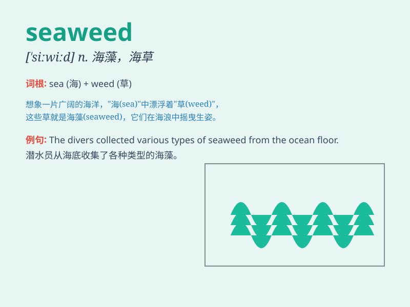

## seaweed

**英音:** _[\'siːwiːd]_ **美音:** _[\'si\'wid]_

**译义:** *n.海草,海藻*

### 短语

+ **red seaweed:** _红藻_

+ **green seaweed:** _绿藻_

+ **dry seaweed:** _干海藻_

+ **fresh seaweed:** _新鲜海藻_

+ **edible seaweed:** _可食用的海藻_

### 例句

#### 例句1

> **The beach was covered with seaweed after the storm.**

**中文翻译:** 暴风雨过后，海滩上布满了海藻。

**单词释义:** 海藻

#### 例句2

> **She collected some seaweed to make a natural fertilizer for her
garden.**

**中文翻译:** 她收集了一些海藻来为她的花园制作天然肥料。

**单词释义:** 海藻

#### 例句3

> **The divers saw beautiful seaweed of various colors
underwater.**

**中文翻译:** 潜水员在水下看到了各种颜色的美丽海藻。

**单词释义:** 海藻

### 背诵小故事

> A little fish was lost in the vast sea. It swam around and finally
found a safe place among the seaweed. The seaweed was like a green
forest, protecting the little fish from danger.

**一条小鱼在广阔的大海中迷路了。它四处游动，最后在海藻中找到了一个安全的地方。海藻就像一片绿色的森林，保护着小鱼免受危险。**

### 图义

