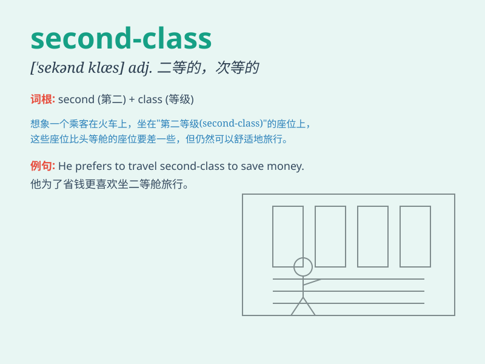

## second-class

**英音:** _[ˈsekənd klɑ:s]_ **美音:** _[ˈsɛkənd klas]_

**译义:** *adj.二等的；次等的；二流的*

### 短语

+ **second-class citizen:** _二等公民_

+ **second-class ticket:** _二等票_

+ **second-class mail:** _二类邮件_

+ **second-class degree:** _二等学位_

+ **second-class cabin:** _二等舱_

### 例句

#### 例句1

> **The train carriage was of second-class quality.**

**中文翻译:** 这节火车车厢是二等质量的。

**单词释义:** 二等的；次等的

#### 例句2

> **She was given a second-class seat on the plane.**

**中文翻译:** 她在飞机上被安排了一个二等座位。

**单词释义:** 二等的；次等的

#### 例句3

> **His work was regarded as second-class by his boss.**

**中文翻译:** 他的工作被老板认为是次等的。

**单词释义:** 次等的；二流的

### 背诵小故事

> 想象一下，你在坐火车，有一等座和二等座。你买的是 second-class
二等座，虽然没有一等座那么豪华，但也能带你到达目的地。它就表示次等的、二流的。

**想象你坐火车买二等座的情景来辅助理解second-class表示次等的、二流的意思**

### 图义

