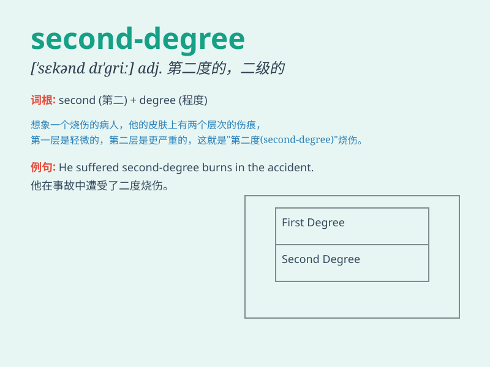

## second-degree

**英音:** _[ˌsekənd dɪˈɡriː]_ **美音:** _[ˌsekənd
dɪˈɡriː]_

**译义:** *adj. 二级的；第二等级的；中度的*

### 短语

+ **second-degree burn:** _二度烧伤_

+ **second-degree murder:** _二级谋杀_

+ **second-degree equation:** _二次方程_

+ **second-degree polynomial:** _二次多项式_

+ **second-degree relatives:** _二级亲属_

### 例句

#### 例句1

> **He was convicted of second-degree murder.**

**中文翻译:** 他被判二级谋杀罪。

**单词释义:** 二级的（用于描述罪行的严重程度）

#### 例句2

> **She suffered second-degree burns on her arm.**

**中文翻译:** 她的手臂遭受了二度烧伤。

**单词释义:** 二度的（用于描述烧伤的程度）

#### 例句3

> **The second-degree equation was quite challenging to solve.**

**中文翻译:** 这个二次方程解起来相当有挑战性。

**单词释义:** 二次的（用于数学术语）

### 背诵小故事

> A detective was solving a crime. The suspect was charged with
second-degree crime, not the most serious but still significant. It was
like being the second-best in a race, not the winner but still notable.

**一位侦探正在侦破一起案件。嫌疑人被指控犯有二级罪行，不是最严重的但仍很重要。这就像在比赛中获得第二名，不是冠军但仍引人注目。**

### 图义

