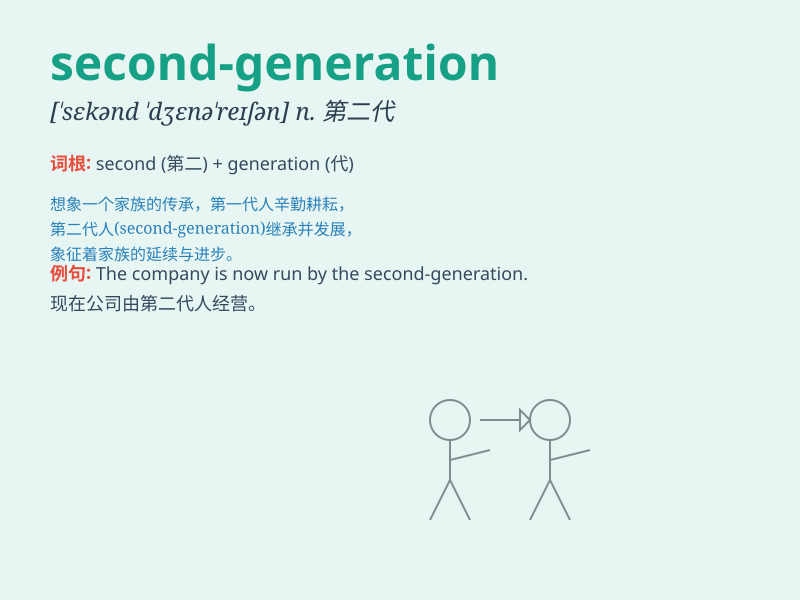

## second-generation

**英音:** _[ˈsɛkənd dʒɛnəˈreɪʃən]_ **美音:** _[ˈsɛkənd
dʒɛnəˈreɪʃən]_

**译义:** *adj.第二代的；n.第二代产品或技术*

### 短语

+ **second-generation immigrant:** _第二代移民_

+ **second-generation product:** _第二代产品_

+ **second-generation entrepreneur:** _第二代企业家_

+ **second-generation technology:** _第二代技术_

+ **second-generation star:** _第二代明星_

### 例句

#### 例句1

> **The second-generation iPhone was a huge improvement over the
first.**

**中文翻译:** 第二代 iPhone 相比第一代有了巨大的改进。

**单词释义:** 第二代的

#### 例句2

> **Second-generation immigrants often face unique challenges.**

**中文翻译:** 第二代移民经常面临独特的挑战。

**单词释义:** 第二代的

#### 例句3

> **The second-generation technology in this field has brought
revolutionary changes.**

**中文翻译:** 这个领域的第二代技术带来了革命性的变化。

**单词释义:** 第二代的

### 背诵小故事

> Imagine a family. The parents are the first generation. Then their
children, who have better opportunities and resources, are the
second-generation. They grow up in a different and improved environment.

**想象一个家庭。父母是第一代。然后他们的孩子，拥有更好的机会和资源，就是第二代。他们在一个不同且改进了的环境中成长。**

### 图义

