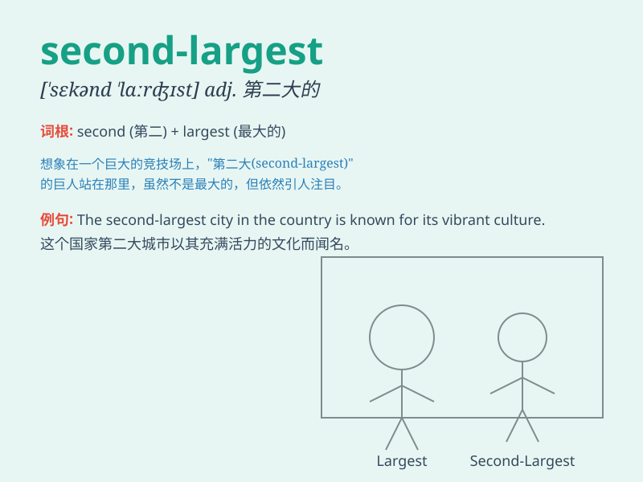

## second-largest

**英音:** __ **美音:** __

**译义:** *第二大的*

### 短语

+ **second-largest city:** _第二大城市_

+ **second-largest country:** _第二大国家_

+ **second-largest economy:** _第二大经济体_

+ **second-largest population:** _第二大人口_

+ **second-largest market:** _第二大市场_

### 例句

#### 例句1

> **China is the second-largest economy in the world.**

**中文翻译:** 中国是世界上第二大经济体。

**单词释义:** 第二大的

#### 例句2

> **The company is the second-largest producer of electronic devices
in the country.**

**中文翻译:** 这家公司是该国第二大电子设备生产商。

**单词释义:** 第二大的

#### 例句3

> **This city has the second-largest population among all the cities
in the province.**

**中文翻译:** 在这个省的所有城市中，这座城市的人口数量位居第二。

**单词释义:** 第二大的

### 背诵小故事

> Imagine a kingdom of fruits. The apple is the largest, but the banana
is the second-largest. It\'s not the biggest, but still holds an
important position. So, second-largest means being the next in size
after the largest one.

**想象一个水果王国。苹果是最大的，而香蕉是第二大的。它不是最大的，但仍占据重要地位。所以，second-largest
意思是在最大的之后，尺寸排第二的。**

### 图义

