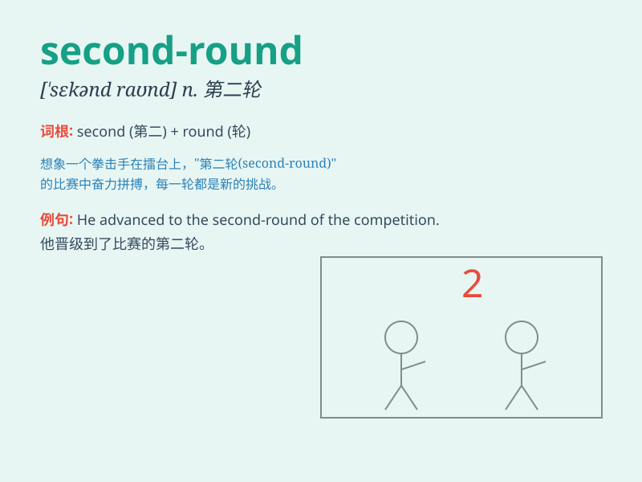

## second-round

**英音:** _[ˈsekənd raʊnd]_ **美音:** _[ˈsɛkənd raʊnd]_

**译义:** *n.第二轮；第二回合；第二阶段*

### 短语

+ **second-round match:** _第二轮比赛_

+ **second-round interview:** _第二轮面试_

+ **second-round voting:** _第二轮投票_

+ **second-round selection:** _第二轮选拔_

+ **second-round candidate:** _第二轮候选人_

### 例句

#### 例句1

> **The second-round interview will be held next week.**

**中文翻译:** 第二轮面试将在下周举行。

**单词释义:** 第二轮的

#### 例句2

> **He qualified for the second-round of the competition.**

**中文翻译:** 他获得了比赛第二轮的参赛资格。

**单词释义:** 第二轮的

#### 例句3

> **The second-round voting attracted more attention.**

**中文翻译:** 第二轮投票吸引了更多的关注。

**单词释义:** 第二轮的

### 背诵小故事

> In a sports competition, Tom was excited as it was the second-round.
He trained hard, hoping to win this round and move forward. The
second-round was a crucial step towards the championship.

**在一场体育比赛中，汤姆很兴奋，因为这是第二轮。他努力训练，希望能赢得这一轮并继续前进。第二轮是迈向冠军的关键一步。**

### 图义

