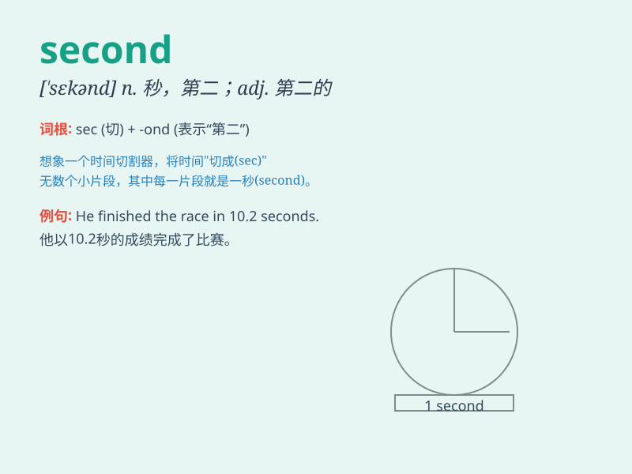

## second

**英音:** _[\'sek(ə)nd]_ **美音:** _[\'sɛkənd]_

**译义:**
*n.秒,片刻,第二者,第二人,助手,次货,二等品adj.另一个,又一个
num.第二vt.赞成,支持*

### 短语

+ **second hand:** _二手的；旧的；间接得来的_

+ **second to none:** _首屈一指；无与伦比_

+ **in a second:** _立刻；马上_

+ **every second:** _每隔一秒_

+ **for a second:** _一会儿；片刻_

### 例句

#### 例句1

> **I came second in the race.**

**中文翻译:** 我在赛跑中得了第二名。

**单词释义:** 第二

#### 例句2

> **He seconded my motion at the meeting.**

**中文翻译:** 在会议上他支持我的提议。

**单词释义:** 支持；赞成

#### 例句3

> **She was second to none in her class in mathematics.**

**中文翻译:** 在她班上，她的数学无人能及。

**单词释义:** 仅次于

### 背诵小故事

> One day, Tom was in a race. He tried his best but came in second. He
was a little sad but also determined to do better next time. Remember,
\'second\' means coming after the first.

**一天，汤姆参加赛跑。他尽了最大努力但得了第二名。他有点难过但也决心下次做得更好。记住，'second'意思是在第一之后。**

### 图义

