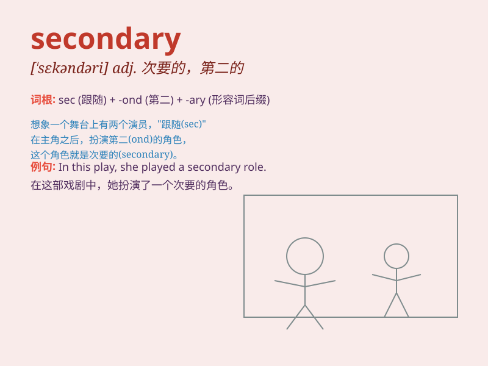

## secondary

**英音:** _[\'sek(ə)nd(ə)rɪ]_ **美音:** _[\'sɛkəndɛri]_

**译义:** *adj.次要的,二级的,中级的,第二的*

### 短语

+ **secondary education:** _中等教育_

+ **secondary school:** _中学_

+ **secondary industry:** _第二产业_

+ **secondary stress:** _次重音_

+ **secondary color:** _合成色；次生色_

### 例句

#### 例句1

> **She teaches secondary school students.**

**中文翻译:** 她教中学的学生。

**单词释义:** 中学的

#### 例句2

> **The problem was of secondary importance.**

**中文翻译:** 这个问题处于次要地位。

**单词释义:** 次要的

#### 例句3

> **He found a secondary source of income.**

**中文翻译:** 他找到了一份次要的收入来源。

**单词释义:** 次要的；第二的

### 背诵小故事

> A student named Lily always felt secondary in her class. She was not
the top one but still worked hard. One day, she got a chance to show her
skills and proved that being secondary doesn\'t mean being unimportant.

**一个叫莉莉的学生在她的班上总觉得自己是次要的。她不是第一名，但仍然努力学习。有一天，她得到了一个展示自己技能的机会，并证明了处于次要地位并不意味着不重要。**

### 图义

