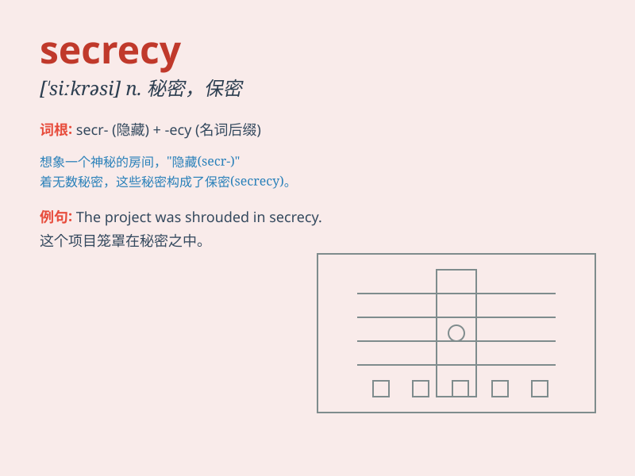

## secrecy

**英音:** _[\'siːkrɪsɪ]_ **美音:** _[\'sikrəsi]_

**译义:** *n.秘密,保密*

### 短语

+ **in secrecy:** _秘密地；暗中_

+ **keep secrecy:** _保守秘密_

+ **maintain secrecy:** _保持秘密_

+ **breach of secrecy:** _泄密_

+ **preserve secrecy:** _维护秘密_

### 例句

#### 例句1

> **The operation was conducted in secrecy.**

**中文翻译:** 这次行动是秘密进行的。

**单词释义:** 秘密

#### 例句2

> **They maintained a policy of secrecy about the project.**

**中文翻译:** 他们对这个项目保持保密政策。

**单词释义:** 保密

#### 例句3

> **The company was accused of operating in secrecy to avoid public
scrutiny.**

**中文翻译:** 这家公司被指控秘密运作以逃避公众监督。

**单词释义:** 秘密状态

### 背诵小故事

> A spy was sent on a mission. The key to his success was secrecy. He
had to hide all his actions and plans to avoid being discovered. Only by
maintaining secrecy could he complete the important task.

**一名间谍被派去执行任务。他成功的关键在于保密。他必须隐藏自己所有的行动和计划以避免被发现。只有保持保密，他才能完成重要任务。**

### 图义

