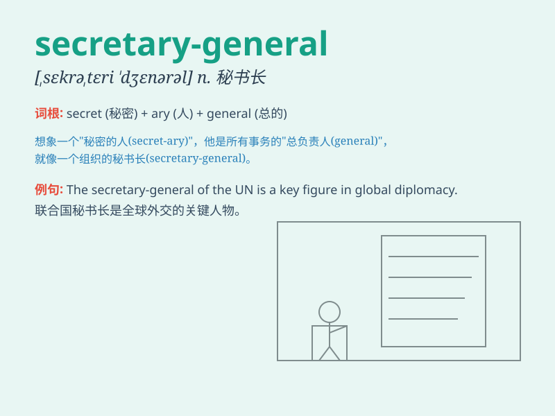

## secretary-general

**英音:** _[ˌsekrəˈteri ˈdʒenərəl]_ **美音:**
_[ˌsekˈretəri ˈdʒenərəl]_

**译义:** *秘书长；联合国秘书长（United Nations
Secretary-General）；（公司、协会等的）秘书（相当于
secretary，并主管行政事务）*

### 短语

+ **secretary-general of the United Nations:** _联合国秘书长_

+ **assistant secretary-general:** _助理秘书长_

+ **deputy secretary-general:** _副秘书长_

+ **under-secretary-general:** _副秘书长；次长_

+ **secretary-general\'s office:** _秘书长办公室_

### 例句

#### 例句1

> **The secretary-general of the United Nations addressed the
assembly.**

**中文翻译:** 联合国秘书长在大会上发表了讲话。

**单词释义:** 联合国秘书长

#### 例句2

> **The secretary-general of the organization is responsible for
coordinating the activities.**

**中文翻译:** 该组织的秘书长负责协调各项活动。

**单词释义:** 该组织的秘书长

#### 例句3

> **She was elected as the secretary-general of the club last
year.**

**中文翻译:** 她去年被选为俱乐部的秘书长。

**单词释义:** 俱乐部的秘书长

### 背诵小故事

> 想象一个神秘的组织，首领被称为
secretary-general。这位首领掌握着组织的核心秘密，他坐在大大的办公桌后，处理着各种机密事务，就像掌控着组织的密码锁。

**想象一个关于"秘书长；总书记"这个词的故事，描述其掌控机密事务的形象**

### 图义

