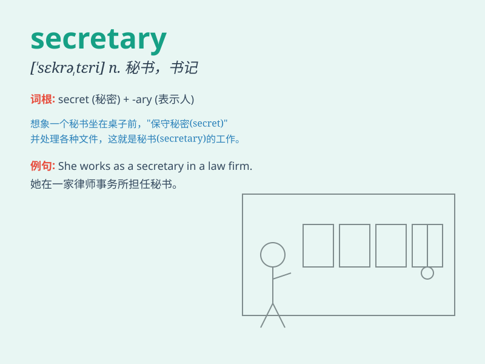

## secretary

**英音:** _[ˈsekrətrɪ]_ **美音:** _[ˈsɛkrəˌtɛrɪ]_

**译义:** *n.秘书,书记,部长,大臣*

### 短语

+ **private secretary:** _私人秘书_

+ **company secretary:** _公司秘书_

+ **secretary general:** _秘书长；总书记_

+ **executive secretary:** _执行秘书；行政秘书_

+ **parliamentary secretary:** _政务次官_

### 例句

#### 例句1

> **The secretary typed the report carefully.**

**中文翻译:** 秘书认真地打印了报告。

**单词释义:** 秘书

#### 例句2

> **She works as a secretary in a big company.**

**中文翻译:** 她在一家大公司里担任秘书工作。

**单词释义:** 秘书

#### 例句3

> **The boss relies heavily on his secretary for organizing
meetings.**

**中文翻译:** 老板在组织会议方面非常依赖他的秘书。

**单词释义:** 秘书

### 背诵小故事

> A long time ago, a king had a trusted helper. This helper knew all
the king\'s secrets and handled important matters. This helper was like
a \'secretary\'. One day, a thief tried to steal the secrets, but the
secretary protected them well.

**很久以前，一位国王有一个值得信赖的助手。这个助手知晓国王所有的秘密并处理重要事务。这个助手就像是一个"秘书"。有一天，一个小偷试图窃取秘密，但秘书保护得很好。**

### 图义

