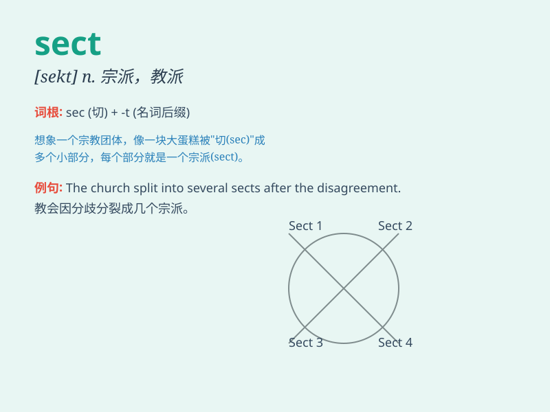

## sect

**英音:** _[sekt]_ **美音:** _[sɛkt]_

**译义:** *n.宗派,教派,教士会,流派,部分,段*

### 短语

+ **sect leader:** _教派领袖_

+ **religious sect:** _宗教派别_

+ **sect member:** _教派成员_

+ **sect conflict:** _教派冲突_

+ **sect division:** _教派分裂_

### 例句

#### 例句1

> **The religious sect has its own unique beliefs and practices.**

**中文翻译:** 这个宗教派别有着自己独特的信仰和实践。

**单词释义:** 派别；宗派

#### 例句2

> **She was attracted to a strange sect during her travels.**

**中文翻译:** 她在旅行期间被一个奇怪的派别所吸引。

**单词释义:** 派别；宗派

#### 例句3

> **The sect split into several smaller groups.**

**中文翻译:** 这个派别分裂成了几个较小的团体。

**单词释义:** 派别；宗派

### 背诵小故事

> Imagine a group of people who are very different from others. They
form a special sect. They have their own unique beliefs and ways of
doing things. This sect stands out among the crowd.

**想象有一群人与其他人非常不同。他们组成了一个特殊的派别。他们有自己独特的信仰和做事方式。这个派别在人群中很突出。**

### 图义

