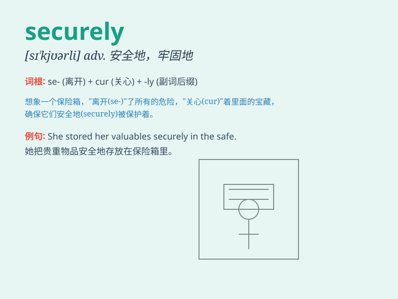

## securely

**英音:** _[sɪ\'kjʊəlɪ]_ **美音:** _[sɪ\'kjʊrli]_

**译义:** *adv.安心地,安全地*

### 短语

+ **lock securely:** _牢固地锁上_

+ **store securely:** _安全地存储_

+ **attach securely:** _牢固地附上_

+ **fasten securely:** _牢牢地系紧_

+ **hold securely:** _稳稳地握住_

### 例句

#### 例句1

> **The documents were securely locked away in a safe.**

**中文翻译:** 这些文件被安全地锁在一个保险箱里。

**单词释义:** 安全地

#### 例句2

> **The package was securely tied with ropes.**

**中文翻译:** 包裹被绳子牢牢地捆着。

**单词释义:** 牢牢地

#### 例句3

> **The climber was securely fastened to the rope.**

**中文翻译:** 登山者被牢牢地系在绳子上。

**单词释义:** 牢牢地

### 背诵小故事

> A thief tried to steal a precious diamond, but the security guard
locked it securely in a safe. No matter how hard the thief tried, he
couldn\'t get it. \'Securely\' means in a safe and protected way.

**一个小偷试图偷一颗珍贵的钻石，但保安把它安全地锁在了保险箱里。无论小偷怎么努力，都拿不到。'securely'意思是以安全且受保护的方式。**

### 图义

