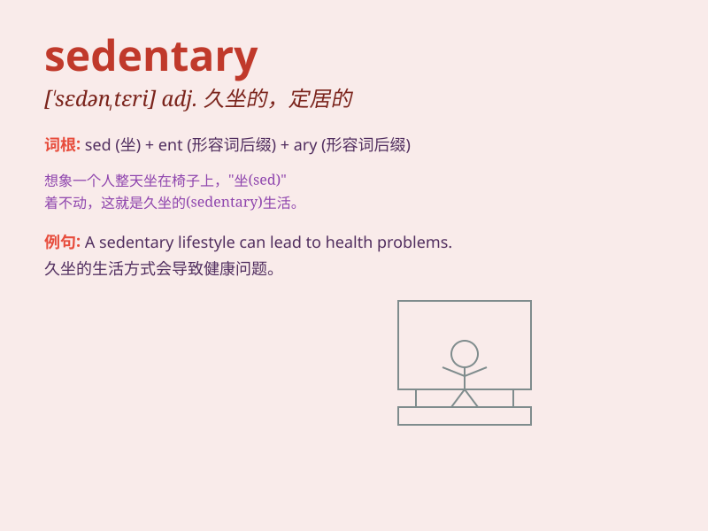

## sedentary

**英音:** _[\'sed(ə)nt(ə)rɪ]_ **美音:** _[\'sɛdntɛri]_

**译义:** *adj.久坐的,坐惯的,土生的,不移栖的,沉积的n.惯于久坐的人*

### 短语

+ **sedentary lifestyle:** _久坐不动的生活方式_

+ **sedentary occupation:** _久坐的职业_

+ **sedentary habits:** _久坐的习惯_

+ **sedentary work:** _久坐的工作_

+ **sedentary activity:** _久坐不动的活动_

### 例句

#### 例句1

> **She has a sedentary job and rarely exercises.**

**中文翻译:** 她有一份久坐的工作并且很少锻炼。

**单词释义:** 久坐的

#### 例句2

> **A sedentary lifestyle can lead to health problems.**

**中文翻译:** 久坐不动的生活方式可能会导致健康问题。

**单词释义:** 久坐不动的

#### 例句3

> **His father\'s sedentary habits made him overweight.**

**中文翻译:** 他父亲久坐的习惯使他体重超重。

**单词释义:** 久坐的

### 背诵小故事

> A man named Sed always sat in his chair and never moved. His friends
called him Sedentary Sed. He spent all day doing nothing but sitting.
This is how we remember the word \'sedentary\' meaning sitting a lot and
not being active.

**有个叫塞德的人总是坐在椅子上一动不动。他的朋友们叫他久坐不动的塞德。他整天除了坐着什么都不做。这就是我们记住\'sedentary\'这个表示坐得多且不活跃的单词的方法。**

### 图义

