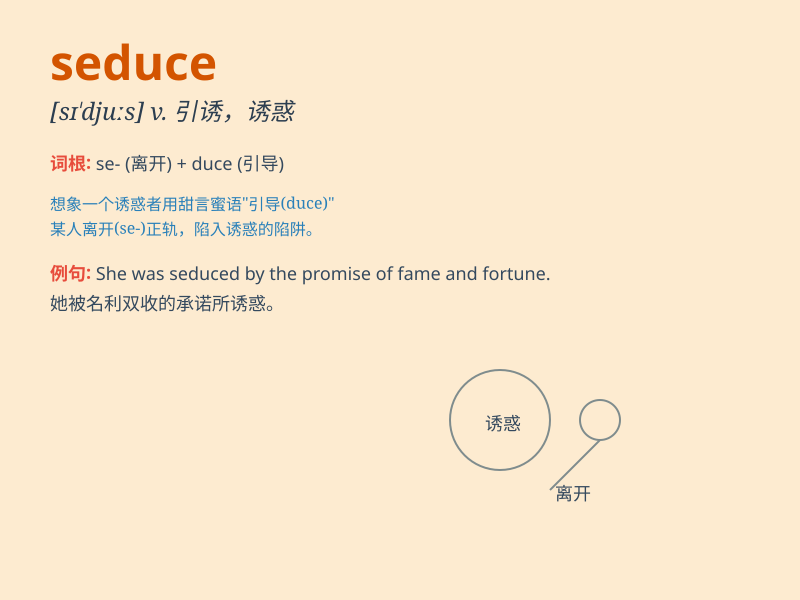

## seduce

**英音:** _[sɪ\'djuːs]_ **美音:** _[sɪ\'dʊs]_

**译义:** *v.诱使*

### 短语

+ **seduce someone into doing something:** _引诱某人做某事_

+ **be seduced by:** _被\...\...诱惑_

+ **seduce away:** _诱使离开_

+ **seduce from:** _从\...\...诱骗_

+ **seduce out of:** _诱使失去_

### 例句

#### 例句1

> **He tried to seduce her with expensive gifts and sweet words.**

**中文翻译:** 他试图用昂贵的礼物和甜言蜜语引诱她。

**单词释义:** 引诱；诱惑

#### 例句2

> **The advertisement is designed to seduce consumers into buying the
product.**

**中文翻译:** 这则广告旨在诱惑消费者购买该产品。

**单词释义:** 诱使；吸引

#### 例句3

> **Don\'t be seduced by the promise of quick profits.**

**中文翻译:** 不要被快速获利的承诺所诱惑。

**单词释义:** 诱惑；迷惑

### 背诵小故事

> A charming prince tried to seduce a beautiful princess by giving her
precious jewels and sweet words. But the princess was wise and resisted
his temptation. Here, \'seduce\' means to tempt or persuade someone to
do something wrong or unwise.

**一位迷人的王子试图用珍贵的珠宝和甜言蜜语引诱美丽的公主。但公主很明智，抵制住了他的诱惑。这里，\'seduce\'意思是引诱或劝诱某人做错误或不明智的事。**

### 图义

