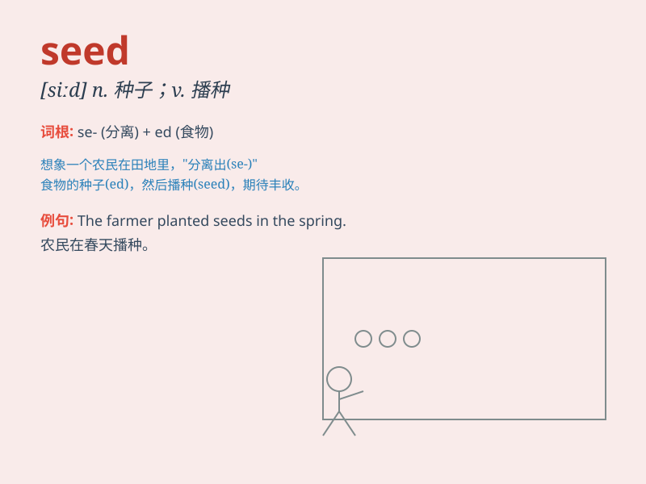

## seed

**英音:** _[siːd]_ **美音:** _[sid]_

**译义:**
*n.种子,萌芽,原由,根据,子孙,精液vt.播种,结实,成熟,去\...籽vi.结实,播种*

### 短语

+ **seed money:** _种子资金；启动资金_

+ **grass seed:** _草籽_

+ **plant seeds:** _播种_

+ **seed pearl:** _小珍珠_

+ **seed crystal:** _晶种；籽晶_

### 例句

#### 例句1

> **The farmer sows the seed in the field.**

**中文翻译:** 这位农民在田地里播种种子。

**单词释义:** 种子

#### 例句2

> **His idea was the seed of a brilliant plan.**

**中文翻译:** 他的想法是一个绝妙计划的萌芽。

**单词释义:** 萌芽；起源

#### 例句3

> **She is trying to seed new hope in their hearts.**

**中文翻译:** 她正试图在他们心中播下新的希望。

**单词释义:** 播种；植入

### 背诵小故事

> One day, a little bird found a seed on the ground. It carried the
seed to a beautiful garden and dropped it. With time and care, the seed
grew into a big, strong tree. The bird was so happy to see the seed
become something wonderful.

**有一天，一只小鸟在地上发现了一颗种子。它把种子带到一个美丽的花园并丢下了它。随着时间和照料，这颗种子长成了一棵又大又壮的树。小鸟看到种子变得如此美妙，非常高兴。**

### 图义

