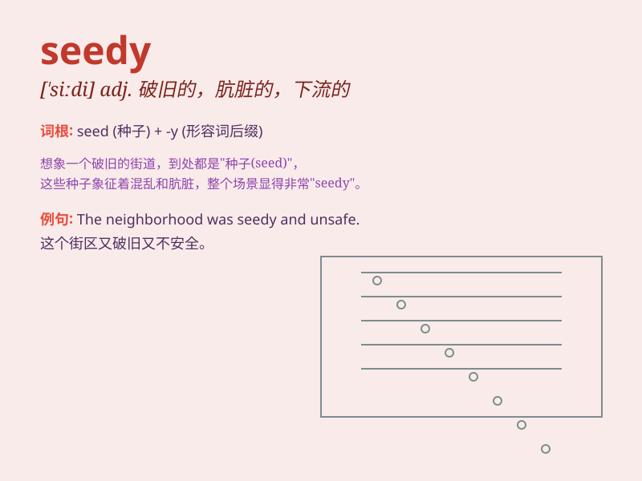

## seedy

**英音:** _[\'siːdɪ]_ **美音:** _[\'sidi]_

**译义:** *adj.多种子的,结籽的,破旧的,褴褛的,不适的*

### 短语

+ **seedy hotel:** _破旧的旅馆_

+ **seedy area:** _破败的地区_

+ **look seedy:** _看起来衣衫褴褛_

+ **seedy character:** _行为不端的人_

+ **seedy clothes:** _破旧的衣服_

### 例句

#### 例句1

> **He stayed in a seedy hotel in the run-down part of town.**

**中文翻译:** 他住在城镇破旧地区的一家破烂的旅馆里。

**单词释义:** 破烂的；肮脏的

#### 例句2

> **The seedy neighborhood was known for its high crime rate.**

**中文翻译:** 这个破败的街区因犯罪率高而闻名。

**单词释义:** 破败的；衰落的

#### 例句3

> **She felt uncomfortable in that seedy bar.**

**中文翻译:** 她在那家低级酒吧里感觉不舒服。

**单词释义:** 低级的；下流的

### 背诵小故事

>
想象一下，有一个破旧的小旅馆，房间昏暗，设施老旧。里面的客人看起来都神情疲惫，穿着邋遢。这个旅馆给人的感觉就是\'seedy\'（破旧的，褴褛的），充满了衰败和不良的气息。

**想象一个破旧的旅馆来辅助记忆\'seedy\'这个表示破旧、褴褛的单词**

### 图义

