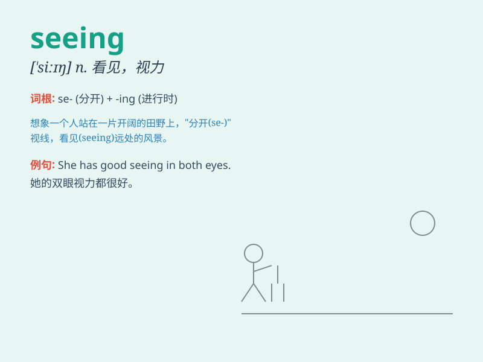

## seeing

**英音:** _[\'siːɪŋ]_ **美音:** _[\'siɪŋ]_

**译义:** *n.视觉,视力,观看,看见*

### 短语

+ **seeing as:** _鉴于；由于_

+ **seeing that:** _因为；鉴于_

+ **be worth seeing:** _值得一看_

+ **on seeing:** _一看到_

+ **keep seeing:** _一直看到；持续看到_

### 例句

#### 例句1

> **Seeing is believing.**

**中文翻译:** 眼见为实。

**单词释义:** 看见；目睹

#### 例句2

> **I enjoy seeing movies on weekends.**

**中文翻译:** 我喜欢在周末看电影。

**单词释义:** 看；观看

#### 例句3

> **Seeing her smile made my day.**

**中文翻译:** 看到她的微笑让我很开心。

**单词释义:** 看到；见到

### 背诵小故事

> One day, a little girl was lost in a forest. She was very scared. But
then, she had the good fortune of seeing a kind ranger who led her back
home safely.

**有一天，一个小女孩在森林里迷路了。她非常害怕。但随后，她幸运地看到了一位善良的护林员，护林员把她安全地带回了家。**

### 图义

