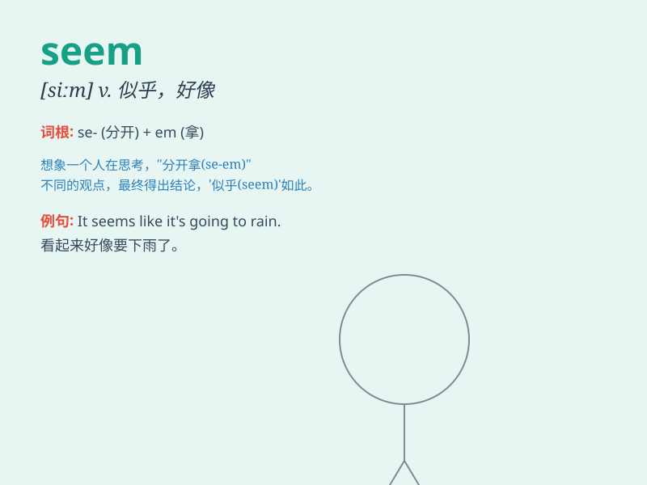

## seem

**英音:** _[siːm]_ **美音:** _[sim]_

**译义:** *vi.象是,似乎*

### 短语

+ **seem to do sth:** _似乎做某事_

+ **seem like:** _好像；似乎_

+ **seem to be:** _似乎是；好像是_

+ **seem as if:** _看起来好像_

+ **seem all right:** _似乎不错_

### 例句

#### 例句1

> **He seems very happy today.**

**中文翻译:** 他今天看起来非常开心。

**单词释义:** 看起来；似乎

#### 例句2

> **The problem seems easy at first glance.**

**中文翻译:** 乍一看这个问题似乎很容易。

**单词释义:** 似乎；好像

#### 例句3

> **It seems that she is not coming.**

**中文翻译:** 看起来她不会来了。

**单词释义:** 看起来；好像

### 背诵小故事

> One day, Tom wore a strange hat. Everyone thought he looked odd, but
he seemed happy. Later we found out he got a prize for the hat. So,
\'seem\' means to give the impression of being something, like Tom
seemed happy even though we were confused.

**一天，汤姆戴了一顶奇怪的帽子。大家都觉得他看起来很怪，但他似乎很开心。后来我们发现他因为这顶帽子得了奖。所以，'seem'意思是给人某种印象，就像汤姆那样，虽然我们困惑但他似乎开心。**

### 图义

