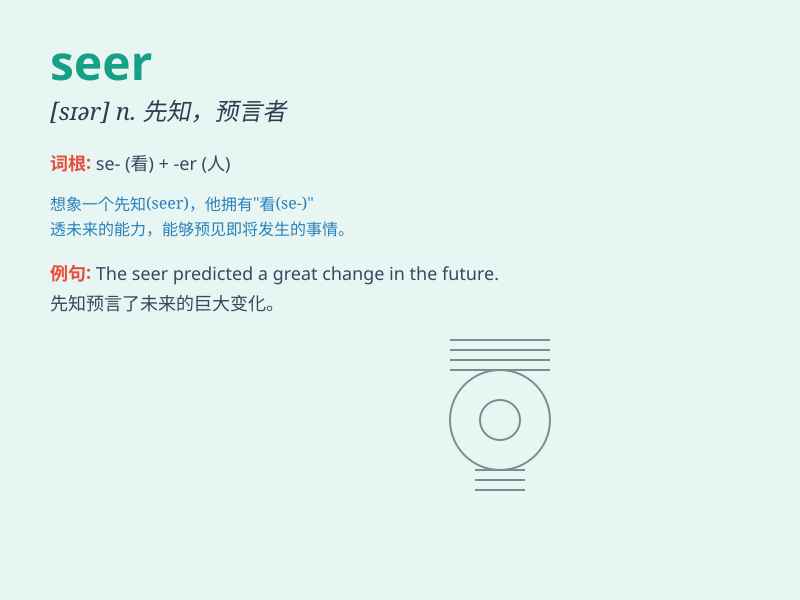

## seer

**英音:** _[\'siːə; sɪə]_ **美音:** _[sɪr]_

**译义:** *n.预言家,先知者,幻想家*

### 短语

+ **clairvoyant seer:** _有洞察力的预言家_

+ **prophetic seer:** _预言的先知_

+ **wise seer:** _睿智的预言者_

+ **mystic seer:** _神秘的预言家_

+ **inspired seer:** _受启发的先知_

### 例句

#### 例句1

> **The seer predicted that a great change was coming.**

**中文翻译:** 这位预言家预言一场巨大的变革即将来临。

**单词释义:** 预言家

#### 例句2

> **In ancient times, the seer was highly respected by the
people.**

**中文翻译:** 在古代，这位预言者深受人们的尊敬。

**单词释义:** 预言者

#### 例句3

> **The seer\'s visions often came true, which made people believe in
his powers.**

**中文翻译:** 这位预言家的幻象常常成真，这使得人们相信他的力量。

**单词释义:** 预言家

### 背诵小故事

> Once upon a time, in a magical land, there was a wise seer. People
came from far and wide to seek his predictions. He could see the future
clearly and guide them. The seer was respected and trusted by all.

**从前，在一片神奇的土地上，有一位睿智的预言家。人们从四面八方赶来寻求他的预言。他能清晰地看到未来并指引他们。这位预言家受到了所有人的尊敬和信任。**

### 图义

