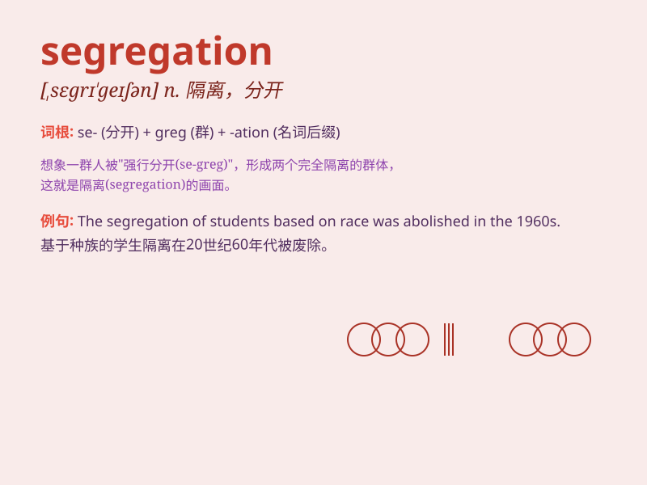

## segregation

**英音:** _[,segrɪ\'geɪʃ(ə)n]_ **美音:**
_[\'sɛgrɪ\'geʃən]_

**译义:** *n.种族隔离*

### 短语

+ **racial segregation:** _种族隔离_

+ **gender segregation:** _性别隔离_

+ **segregation policy:** _隔离政策_

+ **school segregation:** _学校隔离_

+ **segregation barrier:** _隔离障碍_

### 例句

#### 例句1

> **Racial segregation was once a serious problem in the United
States.**

**中文翻译:** 种族隔离曾经是美国的一个严重问题。

**单词释义:** 隔离；分离

#### 例句2

> **The school segregation led to unequal educational opportunities
for children.**

**中文翻译:** 学校隔离导致孩子们获得不平等的教育机会。

**单词释义:** 隔离；分隔

#### 例句3

> **Segregation of waste is important for environmental
protection.**

**中文翻译:** 垃圾分类对于环境保护很重要。

**单词释义:** 分类；分离

### 背诵小故事

> In a small town, there was a strict segregation. People were divided
by their skin color. One brave child crossed the line, showing that such
segregation was wrong. Segregation means the separation of different
groups, especially in an unfair way.

**在一个小镇上，存在着严格的隔离。人们因肤色被划分。一个勇敢的孩子跨越了界限，表明这种隔离是错误的。segregation
意思是不同群体的分离，尤指不公平的分离。**

### 图义

