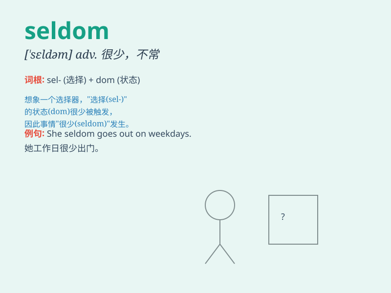

## seldom

**英音:** _[\'seldəm]_ **美音:** _[\'sɛldəm]_

**译义:** *adv.很少,不常*

### 短语

+ **seldom if ever:** _极少；难得_

+ **seldom or never:** _极难得；简直不_

+ **very seldom:** _很少；极少见_

+ **seldom seen:** _罕见的_

+ **seldom heard:** _很少听到的_

### 例句

#### 例句1

> **I seldom go to the cinema.**

**中文翻译:** 我很少去电影院。

**单词释义:** 很少

#### 例句2

> **She seldom eats junk food.**

**中文翻译:** 她很少吃垃圾食品。

**单词释义:** 很少

#### 例句3

> **We seldom have snow in winter here.**

**中文翻译:** 我们这里冬天很少下雪。

**单词释义:** 很少

### 背诵小故事

> There was a little town where a boy named Tom seldom went to the
candy store. Because he was allergic to most candies. So \'seldom\'
means not often or rarely.

**有一个小镇，一个叫汤姆的男孩很少去糖果店。因为他对大多数糖果过敏。所以'seldom'意思是不常，很少。**

### 图义

