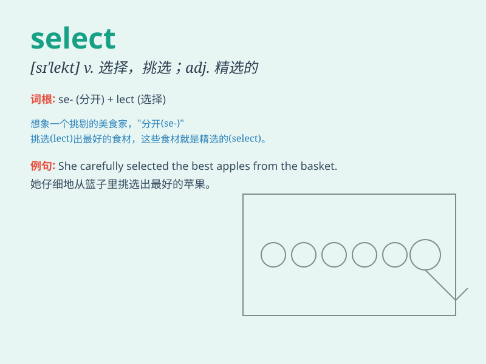

## select

**英音:** _[sɪ\'lekt]_ **美音:** _[sə\'lɛkt]_

**译义:** *vt.选择,挑选adj.精选的*

### 短语

+ **select committee:** _特别委员会_

+ **select group:** _精选的小组_

+ **select option:** _选择选项_

+ **select carefully:** _仔细挑选_

+ **select from:** _从\...\...中选择_

### 例句

#### 例句1

> **I need to select a book to read this weekend.**

**中文翻译:** 我需要挑选一本书在这个周末读。

**单词释义:** 挑选

#### 例句2

> **The committee will select the best candidate for the job.**

**中文翻译:** 委员会将为这份工作选出最佳候选人。

**单词释义:** 选出

#### 例句3

> **Please select the correct answer from the options given.**

**中文翻译:** 请从给出的选项中选择正确答案。

**单词释义:** 选择

### 背诵小故事

> 有一天，小明去商店买衣服，面对众多款式，他需要 SELECT
挑选出自己最喜欢的那件。这就像从众多选项中精心选出最适合的，这就是
select 选择的意思。

**有一天，小明去商店买衣服，面对众多款式，他需要选择挑选出自己最喜欢的那件。这就像从众多选项中精心选出最适合的，这就是
select 选择的意思。**

### 图义

