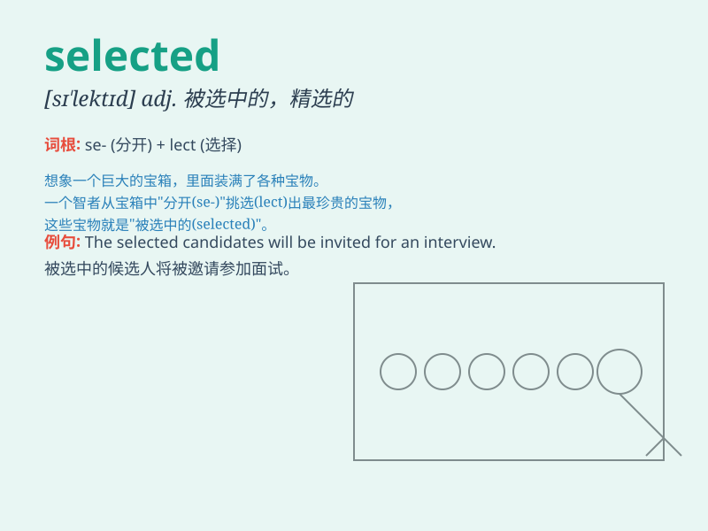

## selected

**英音:** _[sɪ\'lektɪd]_ **美音:** _[sə\'lɛktɪd]_

**译义:** *adj.经由选择的,挑选的*

### 短语

+ **selected works:** _精选作品_

+ **selected items:** _选定项目；所选物品_

+ **selected group:** _选定的小组；挑选出的群体_

+ **selected candidate:** _入选的候选人_

+ **carefully selected:** _精心挑选_

### 例句

#### 例句1

> **He was selected as the team captain.**

**中文翻译:** 他被选为队长。

**单词释义:** 被选择

#### 例句2

> **The selected candidates will be informed next week.**

**中文翻译:** 被选中的候选人下周会得到通知。

**单词释义:** 被选中的

#### 例句3

> **She carefully selected the best dress for the party.**

**中文翻译:** 她仔细挑选了参加聚会的最佳礼服。

**单词释义:** 挑选

### 背诵小故事

> A prince needed to select a special gift for the princess. He went
through many items and finally selected a beautiful necklace. It made
the princess very happy.

**一位王子需要为公主挑选一份特别的礼物。他查看了许多物品，最终选定了一条漂亮的项链。这让公主非常开心。**

### 图义

