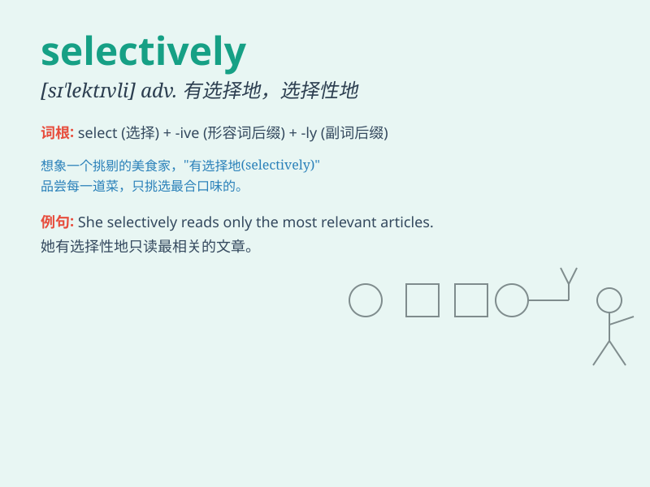

## selectively

**英音:** _[sɪˈlektɪvli]_ **美音:** _[sɪˈlɛktɪvli]_

**译义:** *adv.有选择地；选择性地*

### 短语

+ **selectively permeable:** _选择透过性的_

+ **selectively breeding:** _选择性育种_

+ **selectively censor:** _有选择地审查_

+ **selectively recruit:** _有选择地招募_

+ **selectively ignore:** _有选择地忽略_

### 例句

#### 例句1

> **She selectively reads books on history and avoids fiction.**

**中文翻译:** 她有选择性地阅读历史方面的书籍，并且避开小说。

**单词释义:** 有选择地

#### 例句2

> **The company selectively hires experienced workers.**

**中文翻译:** 这家公司有选择地雇用有经验的工人。

**单词释义:** 有选择地

#### 例句3

> **He selectively invites friends to his parties based on their
interests.**

**中文翻译:** 他根据朋友们的兴趣有选择地邀请他们参加聚会。

**单词释义:** 有选择地

### 背诵小故事

> A picky shopper always selects goods selectively. He carefully
examines each item, choosing only the ones that meet his high standards.
This way, he gets exactly what he wants.

**一个挑剔的购物者总是有选择性地挑选商品。他仔细检查每一件商品，只选择符合他高标准的。通过这种方式，他能得到他确切想要的东西。**

### 图义

