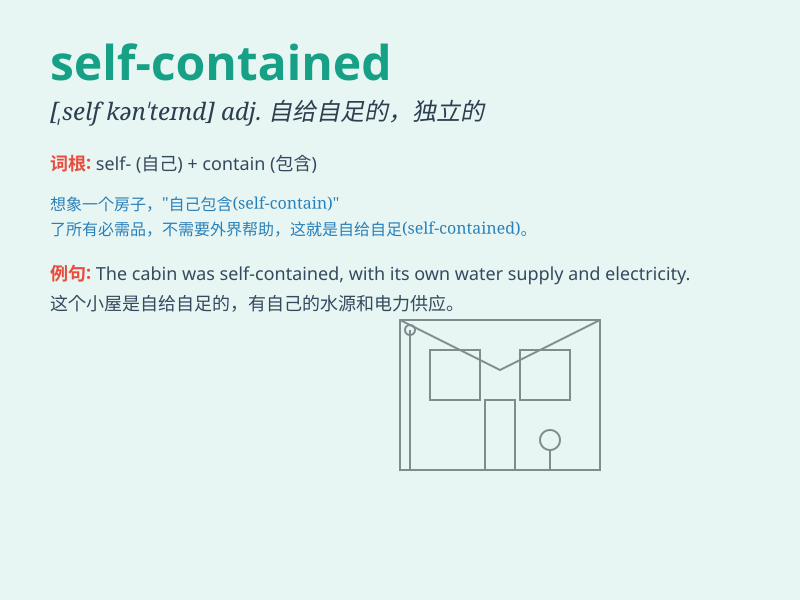

## self-contained

**英音:** _[ˌself kənˈteɪnd]_ **美音:** _[ˌself
kənˈteɪnd]_

**译义:** *adj. 设备齐全的；自给自足的；独立的*

### 短语

+ **self-contained apartment:** _独立公寓_

+ **self-contained unit:** _独立单元_

+ **self-contained system:** _自足系统_

+ **self-contained community:** _自给自足的社区_

+ **self-contained garden:** _独立花园_

### 例句

#### 例句1

> **The self-contained apartment had everything we needed for a
comfortable stay.**

**中文翻译:** 这个设施齐全的公寓具备了我们舒适入住所需的一切。

**单词释义:** 设施齐全的

#### 例句2

> **The self-contained ecosystem of the island is very fragile.**

**中文翻译:** 这个岛屿的独立生态系统非常脆弱。

**单词释义:** 独立的

#### 例句3

> **She is a self-contained person who doesn\'t rely on others
easily.**

**中文翻译:** 她是一个独立自主的人，不轻易依赖他人。

**单词释义:** 独立自主的

### 背诵小故事

> A brave astronaut was on a solo mission in space. His spaceship was
self-contained, having everything needed for survival. It meant it was
complete and independent, not relying on anything outside. Just like the
astronaut was self-sufficient in his tiny world.

**一位勇敢的宇航员正在进行单人太空任务。他的宇宙飞船是自给自足的，拥有生存所需的一切。这意味着它是完备且独立的，不依赖外部任何东西。就像宇航员在他的小世界里能自给自足一样。**

### 图义

