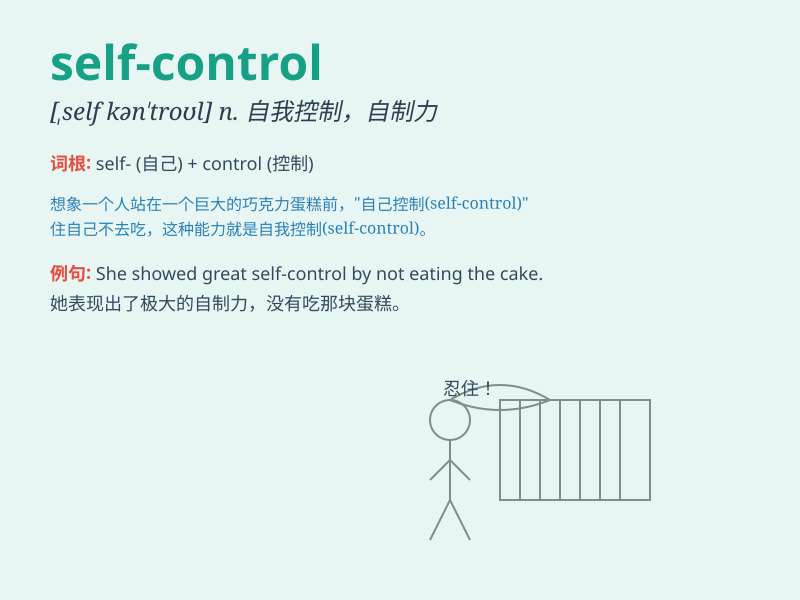

## self-control

**英音:** _[self-ˈkɒn.trol]_ **美音:**
_[self-ˈkɑːn.trol]_

**译义:** *n.自制，克己；自控能力*

### 短语

+ **lose self-control:** _失去自我控制_

+ **gain self-control:** _获得自我控制_

+ **exert self-control:** _施加自我控制_

+ **have self-control:** _有自我控制能力_

+ **improve self-control:** _提高自我控制能力_

### 例句

#### 例句1

> **He has amazing self-control and never loses his temper
easily.**

**中文翻译:** 他有着惊人的自我控制能力，从不轻易发脾气。

**单词释义:** 自我控制；自制

#### 例句2

> **Learning self-control is an important part of growing up.**

**中文翻译:** 学会自我控制是成长的一个重要部分。

**单词释义:** 自我控制；自制

#### 例句3

> **She showed great self-control when facing the temptation of
chocolate.**

**中文翻译:** 面对巧克力的诱惑，她表现出了很强的自我控制力。

**单词释义:** 自我控制；自制

### 背诵小故事

> Once upon a time, Tom was very impulsive. But one day, he decided to
change. He learned to stop himself from making rash decisions. This is
called self-control. With it, Tom became more mature.

**从前，汤姆非常冲动。但有一天，他决定改变。他学会阻止自己做出轻率的决定。这就叫做自我控制。有了它，汤姆变得更成熟了。**

### 图义

