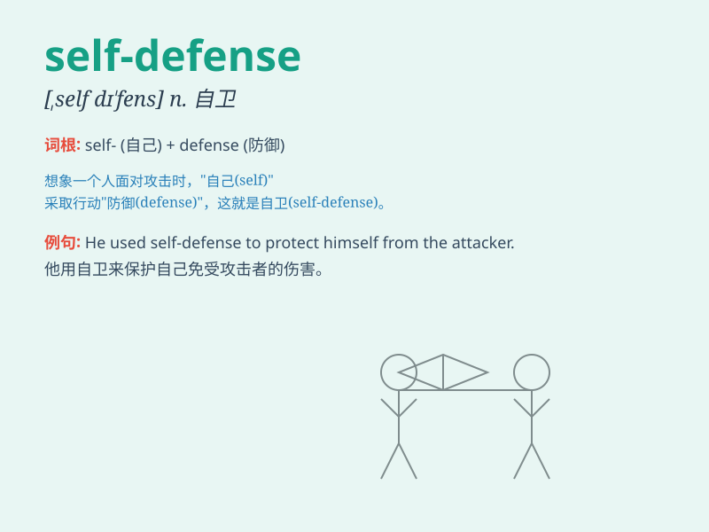

## self-defense

**英音:** _[ˌself dɪˈfens]_ **美音:** _[ˌsɛlf dɪˈfɛns]_

**译义:** *n. 自卫；自我防卫*

### 短语

+ **in self-defense:** _出于自卫_

+ **act in self-defense:** _采取自卫行动_

+ **self-defense mechanism:** _自我防卫机制_

+ **self-defense skills:** _自卫技能_

+ **right of self-defense:** _自卫权_

### 例句

#### 例句1

> **She learned martial arts for self-defense.**

**中文翻译:** 她学习武术用于自卫。

**单词释义:** 自卫；自我防卫

#### 例句2

> **In that situation, using force for self-defense was
justified.**

**中文翻译:** 在那种情况下，使用武力进行自卫是正当的。

**单词释义:** 自卫；自我保护

#### 例句3

> **He carried a knife for self-defense when traveling alone.**

**中文翻译:** 他独自旅行时带了一把刀用于自卫。

**单词释义:** 自卫；防身

### 背诵小故事

> One night, a girl was walking alone in a dark alley. Suddenly, a
strange man appeared. But she was prepared and used her skills for
self-defense. She fought back and escaped safely.

**一天晚上，一个女孩独自走在黑暗的小巷里。突然，一个陌生男人出现了。但她早有准备，运用自我防卫的技能。她反击并安全逃脱。**

### 图义

