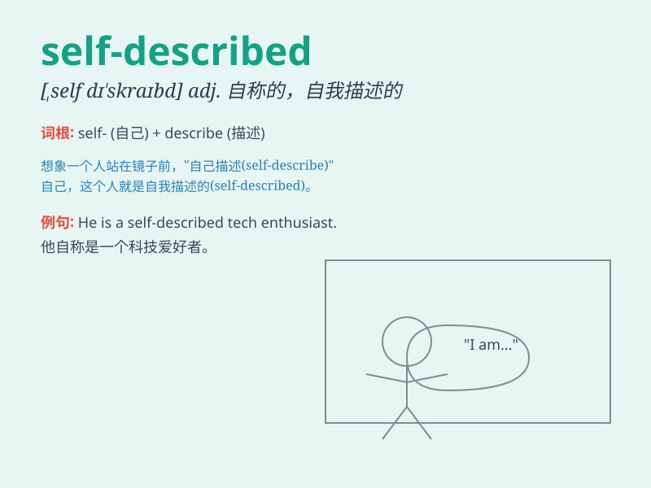

## self-described

**英音:** _[self-дɪˈskraɪbd]_ **美音:**
_[self-dɪˈskraɪbd]_

**译义:** *adj. 自述的；自称为的；自称的*

### 短语

+ **self-described expert:** _自称的专家_

+ **self-described artist:** _自称为艺术家的人_

+ **self-described innovator:** _自称的创新者_

+ **self-described leader:** _自封的领导者_

+ **self-described enthusiast:** _自称的爱好者_

### 例句

#### 例句1

> **He is a self-described expert in history.**

**中文翻译:** 他是一个自称的历史专家。

**单词释义:** 自称的

#### 例句2

> **The self-described artist showed us her latest works.**

**中文翻译:** 这位自称的艺术家向我们展示了她的最新作品。

**单词释义:** 自称的

#### 例句3

> **She is a self-described food lover who travels the world to taste
different cuisines.**

**中文翻译:** 她是一个自称的美食爱好者，周游世界品尝不同的美食。

**单词释义:** 自称的

### 背诵小故事

> A person who is self-described as brave once faced a big challenge.
Instead of running away, he stood firm and proved his self-described
quality. So, self-described means to describe oneself.

**一个自称勇敢的人曾面临巨大挑战。他没有逃跑，而是坚定地站着，证明了他自称的品质。所以，self-described
意思是自称的、自我描述的。**

### 图义

