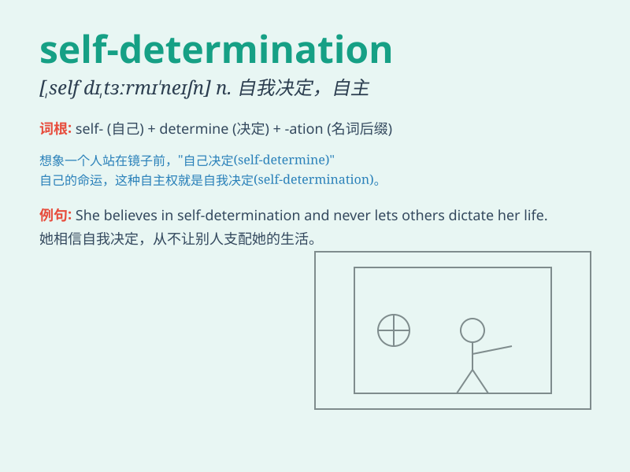

## self-determination

**英音:** _[ˌself dɪˌtɜːmɪˈneɪʃən]_ **美音:** _[ˌself
dɪˌtɜːrmɪˈneɪʃən]_

**译义:** *n. 自我决定；自决权；自主权*

### 短语

+ **exercise self-determination:** _行使自决权_

+ **right of self-determination:** _自决权_

+ **achieve self-determination:** _实现自决_

+ **assert self-determination:** _主张自决_

+ **deny self-determination:** _否定自决权_

### 例句

#### 例句1

> **The right of self-determination is fundamental for every
nation.**

**中文翻译:** 自决权对于每个民族来说都是根本的。

**单词释义:** 自决；自主决定

#### 例句2

> **She achieved success through her self-determination and hard
work.**

**中文翻译:** 她通过自己的决心和努力工作取得了成功。

**单词释义:** 决心；自主决定

#### 例句3

> **The people\'s self-determination should be respected in a
democratic society.**

**中文翻译:** 在民主社会中，人民的自主决定权应该得到尊重。

**单词释义:** 自主决定权

### 背诵小故事

> Once there was a little bird. It had the self-determination to fly
high and explore the unknown. It didn\'t follow others but chose its own
path. It showed great self-determination to achieve its dreams.

**从前有一只小鸟。它有自我决定的能力，想要飞得很高去探索未知。它不跟随他人，而是选择自己的道路。它展现出了强大的自主决定力去实现自己的梦想。**

### 图义

