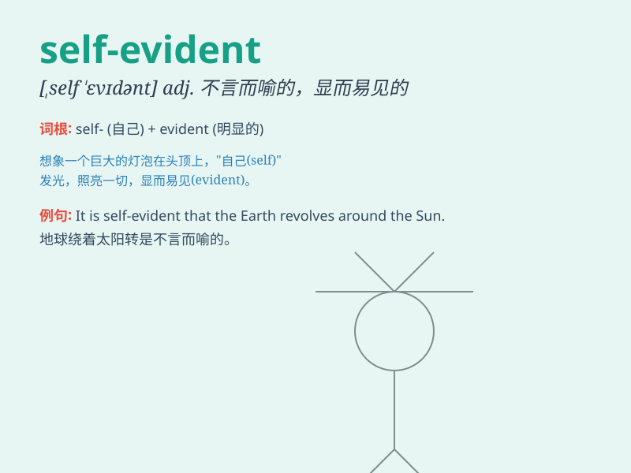

## self-evident

**英音:** _[ˌselfˈɛvɪdənt]_ **美音:** _[ˌsɛlfˈɛvədənt]_

**译义:** *adj. 不言而喻的；不证自明的*

### 短语

+ **be self-evident:** _是不言而喻的_

+ **quite self-evident:** _相当明显的_

+ **self-evident truth:** _不言而喻的真理_

+ **self-evident fact:** _显而易见的事实_

+ **self-evident principle:** _自明的原则_

### 例句

#### 例句1

> **The fact that honesty is important is self-evident.**

**中文翻译:** 诚实很重要这一事实是不言而喻的。

**单词释义:** 不言而喻的；显而易见的

#### 例句2

> **It is self-evident that we need to protect the environment.**

**中文翻译:** 我们需要保护环境，这是显而易见的。

**单词释义:** 不言而喻的；显而易见的

#### 例句3

> **The self-evident truth is that hard work leads to success.**

**中文翻译:** 努力工作会通向成功，这是不言而喻的真理。

**单词释义:** 不言而喻的；显而易见的

### 背诵小故事

> One day, a little boy saw a big tree. It was so tall and strong that
its beauty was self-evident. No one needed to explain how wonderful it
was. The boy just knew it at a glance.

**有一天，一个小男孩看到了一棵大树。它是如此高大强壮，它的美不言而喻。无需任何人解释它有多美妙，小男孩一眼就知道了。**

### 图义

