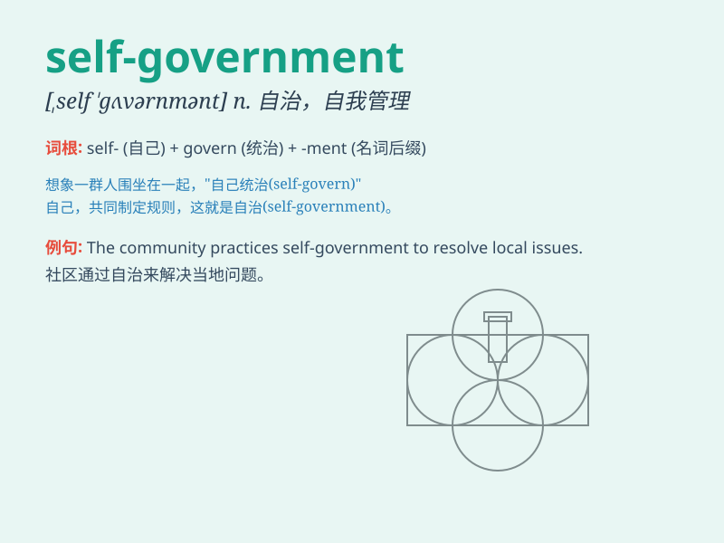

## self-government

**英音:** _[ˌself ˈɡʌvənmənt]_ **美音:** _[ˌself
ˈɡʌvərnmənt]_

**译义:** *n.自治；自制；自我管理*

### 短语

+ **local self-government:** _地方自治_

+ **colonial self-government:** _殖民地自治_

+ **municipal self-government:** _市政自治_

+ **community self-government:** _社区自治_

+ **indigenous self-government:** _原住民自治_

### 例句

#### 例句1

> **The small island achieved self-government after years of
struggle.**

**中文翻译:** 这个小岛经过多年的斗争实现了自治。

**单词释义:** 自治

#### 例句2

> **Self-government gives the local community more control over their
affairs.**

**中文翻译:** 自治让当地社区对他们的事务有了更多的控制权。

**单词释义:** 自治

#### 例句3

> **The principle of self-government is fundamental to a democratic
society.**

**中文翻译:** 自治原则对于一个民主社会来说是基础的。

**单词释义:** 自治

### 背诵小故事

> In a small town, people decided to have self-government. They made
their own rules and managed things themselves. They took care of their
community and made it a better place. This is what self-government
means.

**在一个小镇上，人们决定实行自治。他们制定自己的规则，自己管理事务。他们照顾自己的社区，使其变得更美好。这就是自治的意思。**

### 图义

