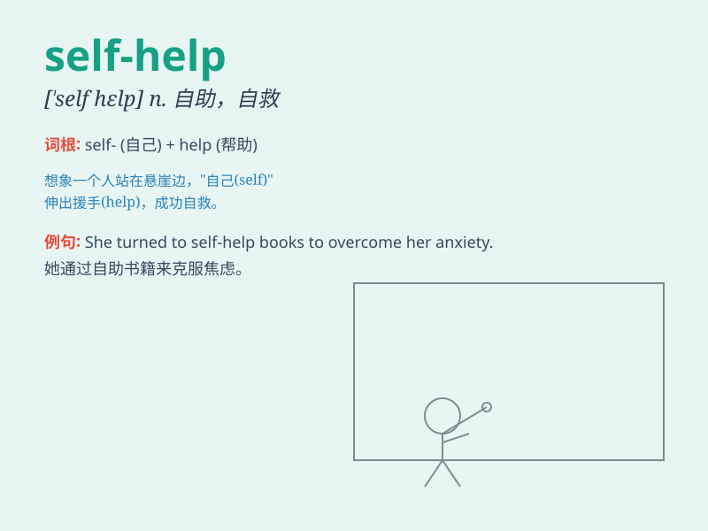

## self-help

**英音:** _[ˌself ˈhelp]_ **美音:** _[ˌself ˈhelp]_

**译义:** *n.自助；自救；自我帮助*

### 短语

+ **self-help book:** _自助书籍_

+ **self-help group:** _自助小组_

+ **self-help program:** _自助项目_

+ **self-help technique:** _自助技巧_

+ **self-help therapy:** _自助疗法_

### 例句

#### 例句1

> **I often read self-help books to gain inspiration and
motivation.**

**中文翻译:** 我经常读自助书籍来获得灵感和动力。

**单词释义:** 自助；自我帮助

#### 例句2

> **The seminar focused on various self-help techniques for stress
management.**

**中文翻译:** 研讨会重点讨论了各种用于压力管理的自我帮助技巧。

**单词释义:** 自助的方法；自我帮助的手段

#### 例句3

> **She turned to self-help groups when she was going through a
difficult time.**

**中文翻译:** 当她经历困难时期时，她向自助小组求助。

**单词释义:** 自助的组织；自我帮助的团体

### 背诵小故事

> Once there was a lost boy. He faced many difficulties but decided to
change by himself. He read books of self-help, learned skills, and
finally found his way. Self-help means improving oneself without
depending on others.

**曾经有一个迷路的男孩。他面临许多困难，但决定自己做出改变。他阅读自助的书籍，学习技能，最终找到了方向。self-help
意思是不依赖他人自我提升。**

### 图义

