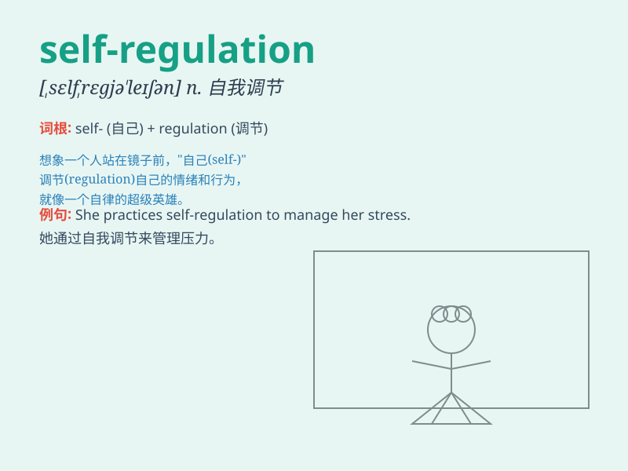

## self-regulation

**英音:** _[ˌself ˌreɡjəˈleɪʃn]_ **美音:** _[ˌself
ˌreɡjəˈleɪʃn]_

**译义:** *n.自我调节；自律；自我管理*

### 短语

+ **self-regulation mechanism:** _自我调节机制_

+ **self-regulation ability:** _自我调节能力_

+ **self-regulation process:** _自我调节过程_

+ **lack of self-regulation:** _缺乏自我调节_

+ **improve self-regulation:** _提高自我调节_

### 例句

#### 例句1

> **Self-regulation is crucial for maintaining a healthy
lifestyle.**

**中文翻译:** 自我调节对于保持健康的生活方式至关重要。

**单词释义:** 自我调节

#### 例句2

> **The company\'s success depends on its ability of self-regulation
in the market.**

**中文翻译:** 公司的成功取决于其在市场中的自我调节能力。

**单词释义:** 自我调节

#### 例句3

> **Children need to learn self-regulation to control their emotions
and behaviors.**

**中文翻译:** 孩子们需要学习自我调节来控制他们的情绪和行为。

**单词释义:** 自我调节

### 背诵小故事

> Imagine a superhero who has the power of self-regulation. He can
control his emotions and actions perfectly. When facing villains, he
doesn\'t act rashly but uses his self-regulation skills to make smart
decisions and save the day.

**想象一个拥有自我调节能力的超级英雄。他能完美地控制自己的情绪和行动。面对坏人时，他不会鲁莽行事，而是运用自我调节技能做出明智决定并拯救世界。**

### 图义

