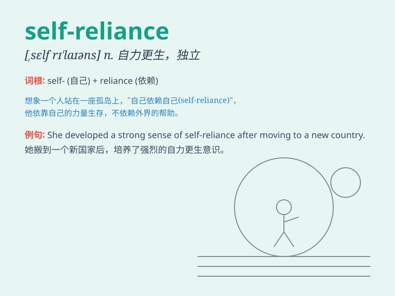

## self-reliance

**英音:** _[ˌself rɪˈlaɪəns]_ **美音:** _[ˌself
rɪˈlaɪəns]_

**译义:** *n.自力更生；依靠自己*

### 短语

+ **achieve self-reliance:** _实现自力更生_

+ **promote self-reliance:** _促进自力更生_

+ **depend on self-reliance:** _依靠自力更生_

+ **encourage self-reliance:** _鼓励自力更生_

+ **cultivate self-reliance:** _培养自力更生_

### 例句

#### 例句1

> **Self-reliance is an important quality for achieving success in
life.**

**中文翻译:** 自力更生是在生活中取得成功的一项重要品质。

**单词释义:** 自力更生；依靠自己

#### 例句2

> **The small community prides itself on its self-reliance in times
of crisis.**

**中文翻译:** 这个小社区在危机时期为其自力更生而感到自豪。

**单词释义:** 自力更生；依靠自己

#### 例句3

> **We should encourage children to develop self-reliance from an
early age.**

**中文翻译:** 我们应该鼓励孩子从小培养自力更生的能力。

**单词释义:** 自力更生；依靠自己

### 背诵小故事

> Once upon a time, there was a young man. He decided to live alone in
the forest. Through facing many challenges, he learned self-reliance. He
cooked, built a shelter, and found food all by himself.

**从前，有个年轻人。他决定独自住在森林里。通过面对众多挑战，他学会了自力更生。他自己做饭、搭建庇护所和寻找食物。**

### 图义

