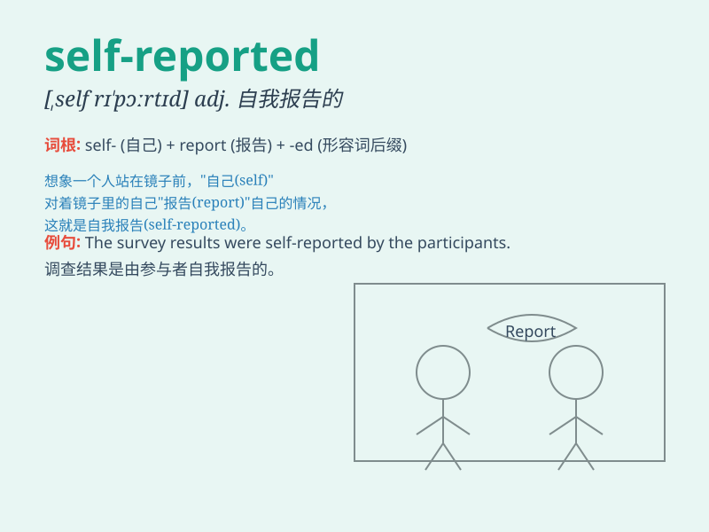

## self-reported

**英音:** _[ˌself rɪˈpɔːrtɪd]_ **美音:** _[ˌself
rɪˈpɔːrtɪd]_

**译义:** *adj. 自我报告的；由本人报告的*

### 短语

+ **self-reported data:** _自我报告的数据_

+ **self-reported survey:** _自我报告式调查_

+ **self-reported behavior:** _自我报告的行为_

+ **self-reported symptoms:** _自我报告的症状_

+ **self-reported experience:** _自我报告的经历_

### 例句

#### 例句1

> **The data was based on self-reported information from the
participants.**

**中文翻译:** 这些数据是基于参与者自我报告的信息。

**单词释义:** 自我报告的

#### 例句2

> **Self-reported symptoms can sometimes be misleading.**

**中文翻译:** 自我报告的症状有时可能会产生误导。

**单词释义:** 自我报告的

#### 例句3

> **The study relied on self-reported health status.**

**中文翻译:** 这项研究依赖于自我报告的健康状况。

**单词释义:** 自我报告的

### 背诵小故事

> A detective was investigating a case. The only evidence was a
self-reported note left by the suspect. It claimed innocence, but the
detective knew better. \'Self-reported\' means given or stated by
oneself.

**一位侦探正在调查一个案件。唯一的证据是嫌疑人留下的一份自我报告的笔记。笔记声称自己是无辜的，但侦探可不这么认为。\'self-reported\'意思是由自己提供或陈述的。**

### 图义

