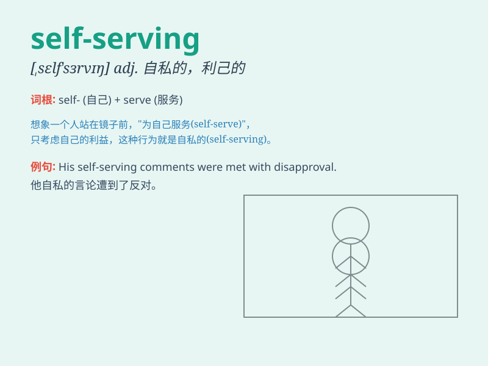

## self-serving

**英音:** _[ˌselfˈsɜːrvɪŋ]_ **美音:** _[ˌselfˈsɜːrvɪŋ]_

**译义:** *adj. 利己的；自私自利的；为自身利益的*

### 短语

+ **self-serving behavior:** _自私自利的行为_

+ **self-serving motives:** _自私的动机_

+ **self-serving attitude:** _自私的态度_

+ **self-serving interests:** _自私的利益_

+ **self-serving actions:** _自私的行动_

### 例句

#### 例句1

> **His actions were seen as self-serving and not in the best
interest of the team.**

**中文翻译:** 他的行为被视为自私自利，不符合团队的最佳利益。

**单词释义:** 自私自利的

#### 例句2

> **The politician\'s speech was full of self-serving promises.**

**中文翻译:** 这位政客的演讲充满了自私的承诺。

**单词释义:** 自私的

#### 例句3

> **She made a self-serving decision that only benefited herself.**

**中文翻译:** 她做了一个只为自己谋利的自私决定。

**单词释义:** 只为自己的；自私的

### 背诵小故事

> A politician was always making decisions that only benefited himself.
People called him self-serving because he cared only about his own
interests. It means acting in a way that is only for one\'s own
advantage.

**一位政客总是做出只对自己有利的决定。人们称他自私自利，因为他只关心自己的利益。这个词的意思是以只为自身谋利的方式行事。**

### 图义

