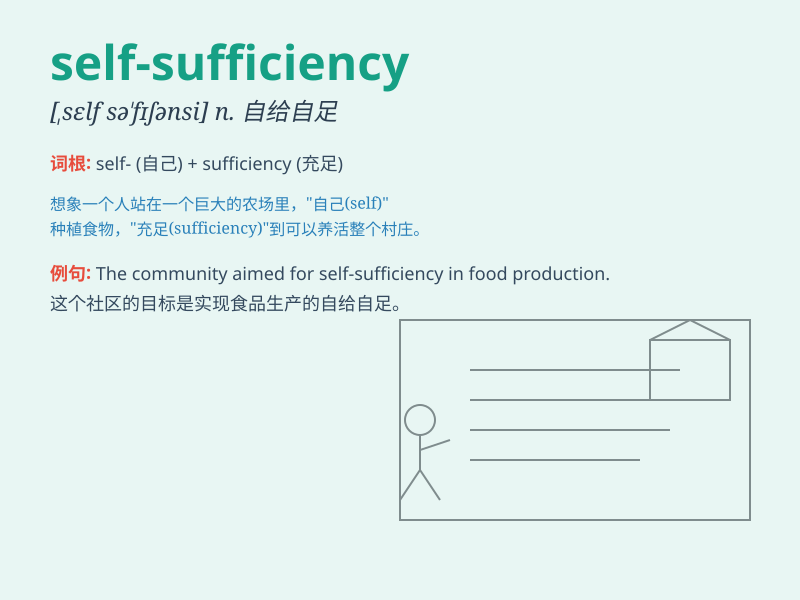

## self-sufficiency

**英音:** _[self-ˈsʌfɪsɪnsi]_ **美音:**
_[self-ˈsʌfɪsənsi]_

**译义:**
*n.自给自足，不依赖他人；自足（指人或地区能够提供自己所需的一切）*

### 短语

+ **achieve self-sufficiency:** _实现自给自足_

+ **economic self-sufficiency:** _经济上的自给自足_

+ **energy self-sufficiency:** _能源自给自足_

+ **food self-sufficiency:** _粮食自给自足_

+ **agricultural self-sufficiency:** _农业自给自足_

### 例句

#### 例句1

> **The small farm aims for self-sufficiency in food production.**

**中文翻译:** 这个小农场的目标是在食品生产方面实现自给自足。

**单词释义:** 自给自足

#### 例句2

> **Living in the countryside, they learned the importance of
self-sufficiency.**

**中文翻译:** 生活在农村，他们了解到了自给自足的重要性。

**单词释义:** 自给自足

#### 例句3

> **The country strives to achieve self-sufficiency in energy
resources.**

**中文翻译:** 这个国家努力在能源资源方面实现自给自足。

**单词释义:** 自给自足

### 背诵小故事

> Once upon a time, there was a small village. The villagers were proud
of their self-sufficiency. They grew food, made clothes, and built
houses all by themselves. They didn\'t need to rely on others to live a
happy life.

**从前，有一个小村庄。村民们为他们的自给自足感到骄傲。他们自己种植食物、制作衣服和建造房屋。他们不需要依靠别人就能过上幸福的生活。**

### 图义

