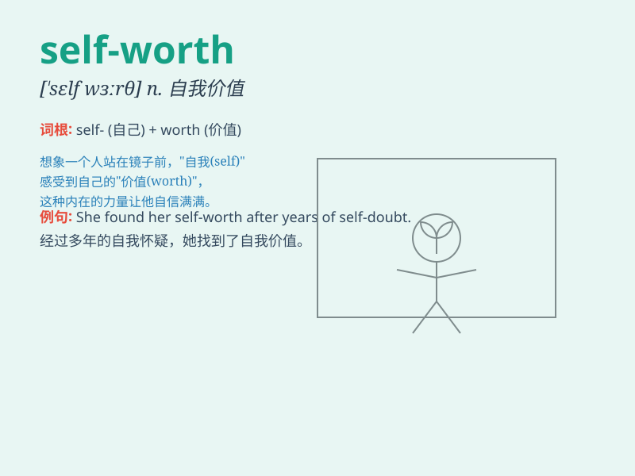

## self-worth

**英音:** _[sɛlf wɜːrθ]_ **美音:** _[sɛlf wɜːrθ]_

**译义:** *n. 自我价值；自尊；自我评价*

### 短语

+ **sense of self-worth:** _自我价值感_

+ **build self-worth:** _建立自我价值_

+ **enhance self-worth:** _提高自我价值_

+ **low self-worth:** _低自我价值_

+ **high self-worth:** _高自我价值_

### 例句

#### 例句1

> **Discovering your true passions can enhance your self-worth.**

**中文翻译:** 发现你真正的热情可以提升你的自我价值。

**单词释义:** 自我价值

#### 例句2

> **She struggled with low self-worth after the divorce.**

**中文翻译:** 离婚后，她一直为自我价值感低而挣扎。

**单词释义:** 自我价值感

#### 例句3

> **Building strong relationships is important for developing
self-worth.**

**中文翻译:** 建立牢固的关系对于培养自我价值很重要。

**单词释义:** 自我价值

### 背诵小故事

> Once there was a girl who always doubted herself. But one day, she
achieved a difficult task all by herself. She realized her abilities and
understood her self-worth. It means the value you believe you have as a
person.

**从前有个女孩总是自我怀疑。但有一天，她独自完成了一项艰巨的任务。她意识到了自己的能力，明白了自我价值。它指的是你认为自己作为一个人的价值。**

### 图义

