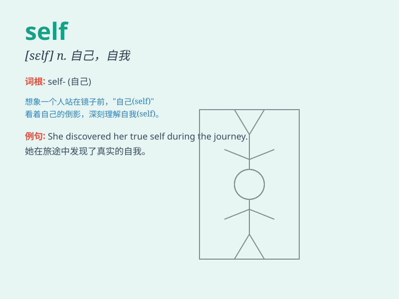

## self

**英音:** _[self]_ **美音:** _[sɛlf]_

**译义:**
*n.自己,自我,本性,本质,本人,私心vt.使近亲繁殖,[植]使自花授精vi.[植]自花授精adj.同一的*

### 短语

+ **self-esteem:** _自尊；自负；自大_

+ **self-awareness:** _自我意识_

+ **self-control:** _自我控制；自制_

+ **self-employed:** _个体经营的；自由职业的_

+ **self-service:** _自助式的；自我服务的_

### 例句

#### 例句1

> **He is too self-centered to consider others\' feelings.**

**中文翻译:** 他太以自我为中心，不考虑别人的感受。

**单词释义:** 自我的；自私的

#### 例句2

> **Self-confidence is the key to success.**

**中文翻译:** 自信是成功的关键。

**单词释义:** 自己；自身

#### 例句3

> **She has a strong sense of self.**

**中文翻译:** 她有很强的自我意识。

**单词释义:** 自我；个性

### 背诵小故事

>
想象一个人在镜子前，看着自己的模样，思考着自己的优点和不足。这个人不断地对自己说：'我要相信
self（自己），我能变得更好。'通过这样的画面，记住 self
就是'自己'的意思。

**想象一个人在镜子前思考自己，从而记住 self 意为'自己'。**

### 图义

