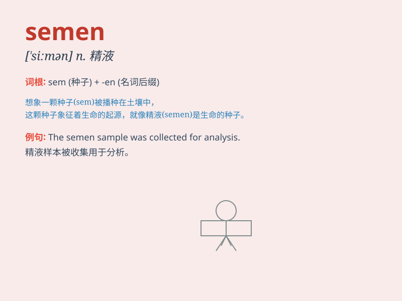

## semen

**英音:** _[\'siːmən]_ **美音:** _[\'simən]_

**译义:** *n.精液,精子*

### 短语

+ **semen analysis:** _精液分析_

+ **semen quality:** _精液质量_

+ **semen collection:** _精液采集_

+ **semen storage:** _精液储存_

+ **semen donation:** _精液捐献_

### 例句

#### 例句1

> **The semen analysis showed a low sperm count.**

**中文翻译:** 精液分析显示精子数量少。

**单词释义:** 精液

#### 例句2

> **Semen is necessary for reproduction.**

**中文翻译:** 精液对于生殖是必要的。

**单词释义:** 精液

#### 例句3

> **The doctor collected the semen sample for testing.**

**中文翻译:** 医生收集了精液样本用于检测。

**单词释义:** 精液

### 背诵小故事

>
想象一下，一位科学家在实验室里研究生命的起源。他专注地观察着显微镜下的液体，那就是semen，也就是生命繁衍所必需的精液。它承载着遗传信息，是新生命诞生的关键。

**想象一位科学家在实验室研究精液，它是生命繁衍必需的，承载遗传信息，是新生命诞生关键。**

### 图义

