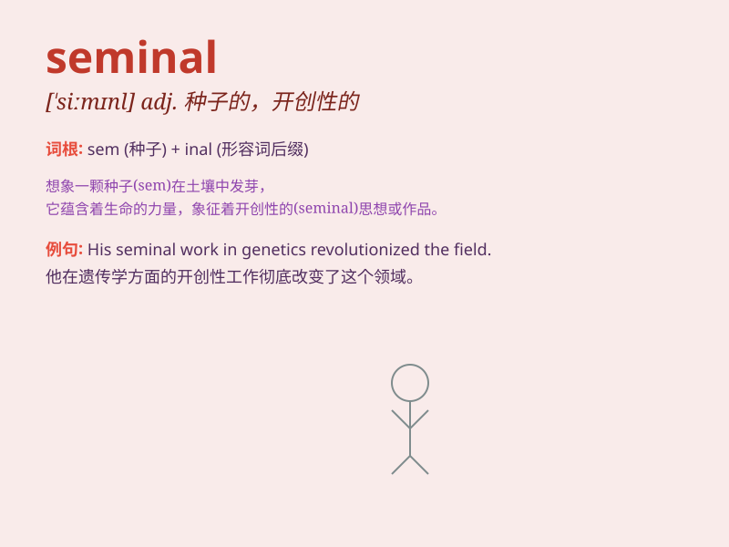

## seminal

**英音:** _[\'semɪn(ə)l]_ **美音:** _[\'sɛmɪnl]_

**译义:** *adj.种子的,精液的,生殖的*

### 短语

+ **seminal work:** _开创性的作品_

+ **seminal idea:** _有重大影响的想法_

+ **seminal paper:** _有深远意义的论文_

+ **seminal study:** _重要的研究_

+ **seminal moment:** _关键的时刻_

### 例句

#### 例句1

> **The book was a seminal work in the field of economics.**

**中文翻译:** 这本书是经济学领域的一部具有开创性的著作。

**单词释义:** 开创性的；有重大影响的

#### 例句2

> **His seminal ideas changed the way we think about education.**

**中文翻译:** 他的创新思想改变了我们对教育的看法。

**单词释义:** 创新的；影响深远的

#### 例句3

> **The scientist\'s seminal research led to many important
discoveries.**

**中文翻译:** 这位科学家的开创性研究带来了许多重要的发现。

**单词释义:** 开创性的；引发重大发展的

### 背诵小故事

>
想象一位科学家在实验室，经过无数次失败后，终于有了一个开创性的想法，这个想法就像一粒种子。这粒种子就是seminal（有重大影响的、影响深远的），它将带来一系列伟大的发明。

**想象一位科学家在实验室产生了一个影响深远的想法，就像一粒种子，将带来伟大发明的故事**

### 图义

