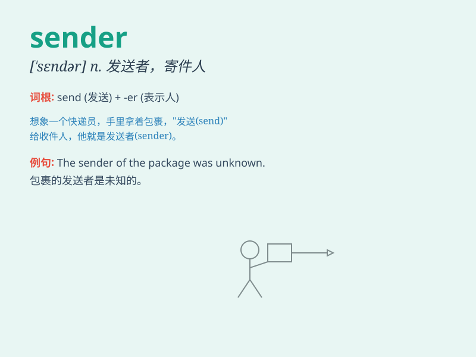

## sender

**英音:** _[\'sendə]_ **美音:** _[\'sɛndɚ]_

**译义:** *n.寄件人,发报机,发话机,发送人(器)*

### 短语

+ **message sender:** _消息发送者_

+ **email sender:** _电子邮件发送者_

+ **signal sender:** _信号发送器_

+ **data sender:** _数据发送方_

+ **package sender:** _包裹寄件人_

### 例句

#### 例句1

> **The sender of the package remained anonymous.**

**中文翻译:** 包裹的寄件人保持匿名。

**单词释义:** 寄件人；发送者

#### 例句2

> **The email sender was identified as a former colleague.**

**中文翻译:** 这封电子邮件的发送者被确认为一位前同事。

**单词释义:** 发送者；发件人

#### 例句3

> **The sender of the message failed to provide contact details.**

**中文翻译:** 这条消息的发送者没有提供联系细节。

**单词释义:** 发送者；发出者

### 背诵小故事

>
想象有个神秘的邮差，他总是在清晨悄悄出现，将信件放入邮箱。这个邮差就是\'sender\'，他的职责是发送信件和物品。人们依赖他传递消息和情感。

**想象有一个神秘的发送者，他总是在清晨悄悄出现，将信件放入邮箱。这个发送者就是"sender"，他的职责是发送信件和物品。人们依赖他传递消息和情感。**

### 图义

