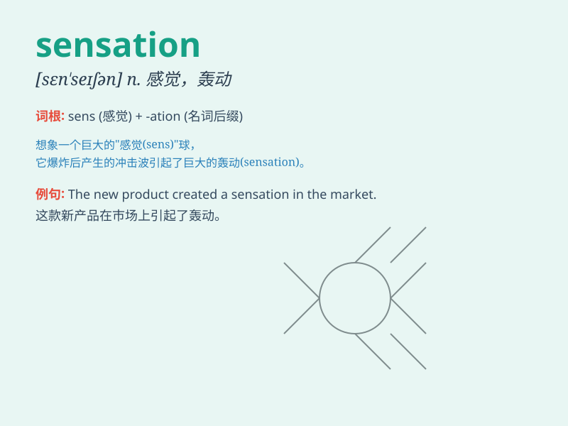

## sensation

**英音:** _[sen\'seɪʃ(ə)n]_ **美音:** _[sɛnˈseʃən]_

**译义:** *n.感觉,感情,感动,耸人听闻的*

### 短语

+ **pleasant sensation:** _愉快的感觉_

+ **sensory sensation:** _感官感觉_

+ **intense sensation:** _强烈的感觉_

+ **visual sensation:** _视觉感受_

+ **bodily sensation:** _身体感觉_

### 例句

#### 例句1

> **The new ride at the amusement park gave me a thrilling
sensation.**

**中文翻译:** 游乐园里的新游乐设施给了我一种令人兴奋的感觉。

**单词释义:** 感觉；知觉；感受

#### 例句2

> **The loss of her job was a painful sensation.**

**中文翻译:** 她失去工作是一种痛苦的感受。

**单词释义:** 感受；感觉

#### 例句3

> **The cool breeze on my face was a pleasant sensation.**

**中文翻译:** 凉爽的微风拂过我的脸，是一种愉悦的感觉。

**单词释义:** 感觉；知觉

### 背诵小故事

> One day, I was walking in the park and suddenly felt a strange
sensation. It was like a gentle breeze touching my skin but with a hint
of mystery. Later I realized it was the sensation of a new beginning.

**有一天，我在公园散步，突然感觉到一种奇怪的感觉。就像一阵轻柔的微风触碰着我的皮肤，但带着一丝神秘。后来我意识到这是一个新开始的感觉。**

### 图义

