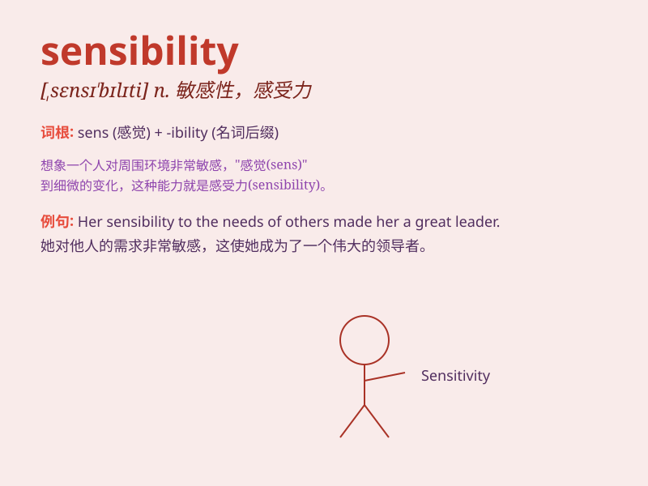

## sensibility

**英音:** _[,sensɪ\'bɪlɪtɪ]_ **美音:**
_[,sɛnsə\'bɪləti]_

**译义:** *n.敏感性*

### 短语

+ **emotional sensibility:** _情感敏感度_

+ **aesthetic sensibility:** _审美感受力_

+ **moral sensibility:** _道德敏感性_

+ **intellectual sensibility:** _智力感受性_

+ **cultural sensibility:** _文化感受力_

### 例句

#### 例句1

> **Her sensibility made her very empathetic towards others\'
feelings.**

**中文翻译:** 她的敏感性使她对他人的感受非常有同理心。

**单词释义:** 敏感性；感受能力

#### 例句2

> **The artist\'s sensibility is reflected in his delicate
paintings.**

**中文翻译:** 这位艺术家的感受力体现在他精致的画作中。

**单词释义:** 感受力；鉴赏力

#### 例句3

> **Lack of sensibility can lead to misunderstandings in
relationships.**

**中文翻译:** 缺乏敏感性可能会导致关系中的误解。

**单词释义:** 敏感性

### 背诵小故事

> A young artist had great sensibility. He could feel the slightest
change in the wind and turn it into beautiful paintings. His sensibility
made his artworks touch people\'s hearts.

**一位年轻的艺术家有着很强的感受力。他能感受到微风最细微的变化，并将其转化为美丽的画作。他的感受力使他的艺术作品触动人们的心灵。**

### 图义

