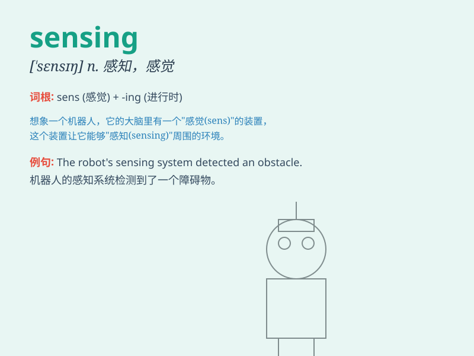

## sensing

**英音:** _[ˈsensɪŋ]_ **美音:** _[ˈsensɪŋ]_

**译义:** *n.传感；感觉；测知*

### 短语

+ **sensing device:** _传感装置；感应装置_

+ **remote sensing:** _遥感；远距离读出_

+ **sensing element:** _传感元件；敏感元件_

+ **sensing technology:** _传感技术；感应技术_

+ **temperature sensing:** _温度传感；温度感应_

### 例句

#### 例句1

> **The robot is equipped with advanced sensing devices.**

**中文翻译:** 这个机器人配备了先进的传感装置。

**单词释义:** 传感；感觉

#### 例句2

> **Sensing danger, the deer ran away quickly.**

**中文翻译:** 感觉到危险，鹿迅速跑开了。

**单词释义:** 感觉到；察觉

#### 例句3

> **Her sensing of the problem was very accurate.**

**中文翻译:** 她对这个问题的感知非常准确。

**单词释义:** 感知；认识

### 背诵小故事

> One day, a little robot was lost in a dark cave. It relied on its
sensing ability to detect obstacles and find the way out. The robot\'s
sensing was like a magic power that helped it survive.

**有一天，一个小机器人在黑暗的洞穴中迷路了。它依靠自己的感知能力来探测障碍物并找到出路。机器人的感知就像一种神奇的力量，帮助它生存下来。**

### 图义

