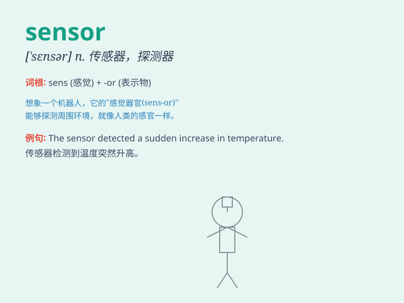

## sensor

**英音:** _[\'sensə]_ **美音:** _[\'sɛnsɚ]_

**译义:** *n.传感器*

### 短语

+ **sensor array:** _传感器阵列_

+ **optical sensor:** _光学传感器_

+ **temperature sensor:** _温度传感器_

+ **pressure sensor:** _压力传感器_

+ **motion sensor:** _运动传感器_

### 例句

#### 例句1

> **The sensor detected a slight movement.**

**中文翻译:** 传感器检测到了轻微的移动。

**单词释义:** 传感器

#### 例句2

> **This car is equipped with multiple sensors to ensure safety.**

**中文翻译:** 这辆车配备了多个传感器以确保安全。

**单词释义:** 传感器

#### 例句3

> **The temperature sensor showed a significant increase.**

**中文翻译:** 温度传感器显示出了显著的升高。

**单词释义:** 传感器

### 背诵小故事

> A brave explorer was lost in a dark cave. Just when he felt hopeless,
a sensor on his wrist shone a light and guided him out. The sensor was
like a magic helper!

**一位勇敢的探险家在黑暗的洞穴中迷路了。就在他感到绝望时，他手腕上的一个传感器发出了光，并引导他走了出去。这个传感器就像一个神奇的助手！**

### 图义

