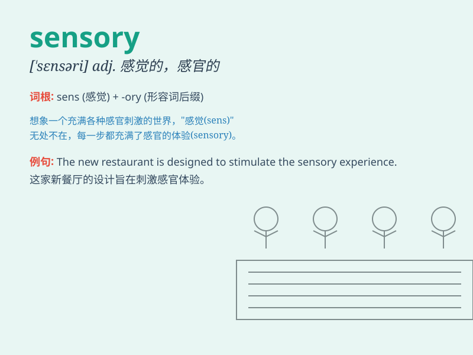

## sensory

**英音:** _[\'sens(ə)rɪ]_ **美音:** _[\'sɛnsəri]_

**译义:** *adj.感觉的,感官的*

### 短语

+ **sensory perception:** _感官知觉_

+ **sensory information:** _感觉信息_

+ **sensory nerve:** _感觉神经_

+ **sensory experience:** _感官体验_

+ **sensory stimulus:** _感觉刺激_

### 例句

#### 例句1

> **The sensory organs of the body include the eyes, ears, nose,
tongue and skin.**

**中文翻译:** 身体的感觉器官包括眼睛、耳朵、鼻子、舌头和皮肤。

**单词释义:** 感觉的；感官的

#### 例句2

> **Sensory information is processed and interpreted by the
brain.**

**中文翻译:** 感觉信息由大脑进行处理和解释。

**单词释义:** 感觉的；感官的

#### 例句3

> **The sensory experience of a new city can be very exciting.**

**中文翻译:** 一个新城市的感官体验可能会非常令人兴奋。

**单词释义:** 感觉的；感官的

### 背诵小故事

> A little mouse was exploring a maze. It used its sensory skills like
sharp smell and sensitive touch to find the way out. The mouse\'s
sensory abilities helped it succeed. Remember, \'sensory\' is about our
senses.

**一只小老鼠正在探索一个迷宫。它运用敏锐的嗅觉和敏感的触觉等感觉技能来寻找出路。老鼠的感觉能力帮助它成功了。记住，\'sensory\'
是关于我们的感觉的。**

### 图义

