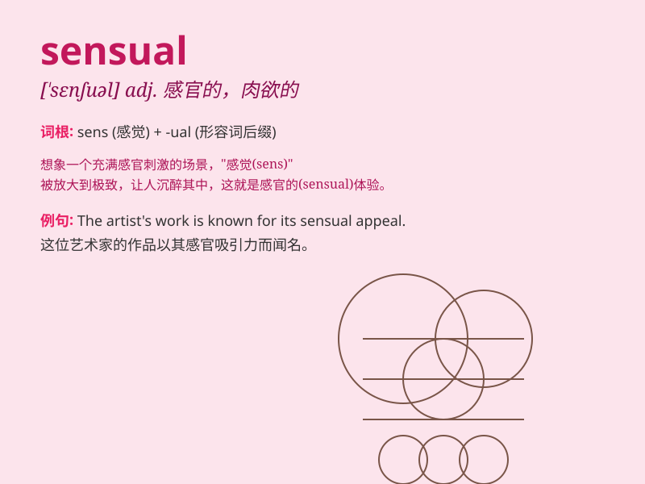

## sensual

**英音:** _[\'sensjʊəl; -ʃʊəl]_ **美音:** _[\'sɛnʃuəl]_

**译义:** *adj.肉欲的,色情的,世俗的,感觉的,感觉论的*

### 短语

+ **sensual pleasure:** _感官愉悦_

+ **sensual experience:** _感官体验_

+ **sensual appeal:** _感官吸引力_

+ **sensual touch:** _性感的触摸_

+ **sensual beauty:** _性感美_

### 例句

#### 例句1

> **The music was so sensual that it made me lose myself in the
moment.**

**中文翻译:** 这首音乐如此性感，以至于让我在那一刻迷失了自我。

**单词释义:** 性感的

#### 例句2

> **She has a sensual way of moving that attracts everyone\'s
attention.**

**中文翻译:** 她有一种性感的移动方式，吸引了每个人的注意。

**单词释义:** 性感的

#### 例句3

> **The perfume has a sensual aroma that lingers in the air.**

**中文翻译:** 这款香水有一种性感的香气，在空气中萦绕。

**单词释义:** 性感的；引起感官愉悦的

### 背诵小故事

> A prince was charmed by a sensual dancer. Her graceful moves and the
soft touch of her dress made him lose his mind. But he later realized
that true beauty lies beyond the sensual pleasures.

**一位王子被一位性感的舞者迷住了。她优雅的动作和裙子柔软的触感让他意乱情迷。但后来他意识到真正的美不仅仅在于感官的愉悦。**

### 图义

