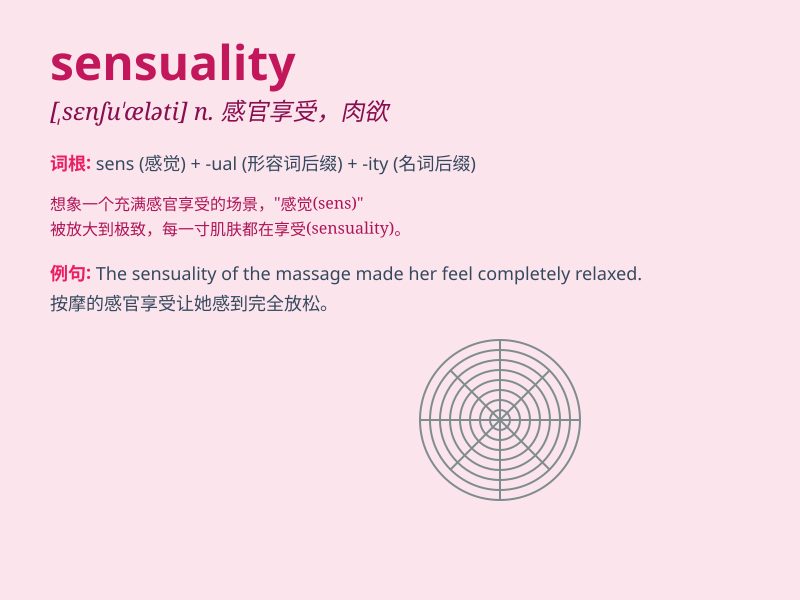

## sensuality

**英音:** _[sensjʊ\'ælɪtɪ; senʃʊ-]_ **美音:**
_[,sɛnʃʊ\'ælɪti]_

**译义:** *n.好色,淫荡,感觉性*

### 短语

+ **indulge in sensuality:** _沉溺于肉欲_

+ **sensuality appeal:** _性感魅力_

+ **world of sensuality:** _肉欲的世界_

+ **sensuality temptation:** _肉欲的诱惑_

+ **explore sensuality:** _探索肉欲_

### 例句

#### 例句1

> **The music was filled with sensuality, making the audience sway
along.**

**中文翻译:** 这首音乐充满了性感，让观众随之摇摆。

**单词释义:** 性感

#### 例句2

> **Her dance performance exuded sensuality and charm.**

**中文翻译:** 她的舞蹈表演散发着性感和魅力。

**单词释义:** 性感

#### 例句3

> **The artist\'s paintings captured the essence of sensuality in
nature.**

**中文翻译:** 这位艺术家的画作捕捉到了大自然中的性感本质。

**单词释义:** 性感

### 背诵小故事

> A prince was charmed by a mysterious woman. Her every move and gaze
were filled with sensuality. The prince was deeply attracted, realizing
it was the allure of her passionate and sensual nature.

**一位王子被一个神秘的女子吸引住了。她的一举一动和每一个眼神都充满了肉欲感。王子深深地被吸引，意识到这是她热情和性感天性的魅力。**

### 图义

